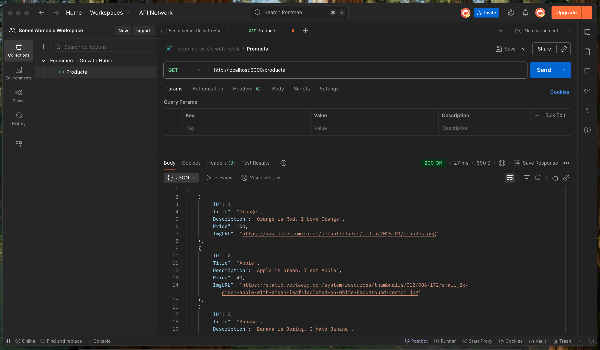

# 047 - Ecommerce Project (GET Request)
http methods(GET, POST, PUT, PATCH, DELETE)
**http** --> means **protocol(rules)**
## what is w http.ResponseWriter, r *http.Request? 
n Go’s net/http package, the signature:
```go
func handler(w http.ResponseWriter, r *http.Request)
```
is the **standard way** to define an HTTP handler function.
Let’s break down both parameters in depth:

1️⃣ w http.ResponseWriter
- **Purpose**: Used to send the **response** back to the client (browser, Postman, etc.).
- **Type**: http.ResponseWriter is an **interface** provided by the **net/http** package.
- **Think of it as**: The output stream where you **write HTML, JSON, text, or headers** that go back to the requester.
- **Common uses**:
```go
w.Write([]byte("Hello, World!"))     // send plain text
w.Header().Set("Content-Type", "application/json")  // set header
w.WriteHeader(http.StatusOK)         // set HTTP status code
```

2️⃣ r *http.Request
- **Purpose**: Represents the incoming **request** from the **client**.
- **Type**: A **pointer** to http.Request **struct**.
- **Think of it as**: A **package** that contains all details about the **HTTP request** — method, URL, headers, body, query params, etc.
- **Common uses**:
```go
fmt.Println(r.Method)         // GET, POST, PUT, DELETE
fmt.Println(r.URL.Path)       // requested path
fmt.Println(r.Header.Get("Content-Type")) // header value
r.ParseForm()                 // parse form data
fmt.Println(r.Form.Get("name"))
```

📊 Visualization
```go
Browser / Client  --->  HTTP Request (r)  --->  Your Go handler
                                     |
Your Go handler --->  HTTP Response (w)  --->  Browser / Client
```

```go
func getProducts(w http.ResponseWriter, r *http.Request){
	if r.Method != http.MethodGet{ //?or r.Method != "GET"
		http.Error(w, "Please give me GET Request", 400)
	}
}
```
**Status Code**:
200 -> all ok
201 -> created a resource on server
400 -> Bad Request. wrong request
404 -> request not found on server
500 -> internal server Error, server is unable to handle the request

**---------------------------------------------------------------------------------------------------------**

```go
package main

import (
	"encoding/json"
	"fmt"
	"net/http"
) //?Here net is a package and http is a sub-package under net package


func helloHandler (w http.ResponseWriter, r *http.Request){
	fmt.Fprintln(w, "Hello World")
}

func aboutHandler(w http.ResponseWriter, r *http.Request){
	fmt.Fprintln(w, "I'm Somel. I'm youtuber. I'm software engineer")
}

type Product struct{
	ID int
	Title string
	Description string
	Price float64
	ImgURL string
}

var productList []Product

func getProducts(w http.ResponseWriter, r *http.Request){
	if r.Method != http.MethodGet{ //?or r.Method != "GET"
		http.Error(w, "Please give me GET Request", 400)
		return
	}
	encoder := json.NewEncoder(w) //? it will create an encoder
	encoder.Encode(productList)


}

func main(){
	mux := http.NewServeMux() //? Here mux is a Router. it will return an address of object
	mux.HandleFunc("/hello", helloHandler) //? route
	mux.HandleFunc("/about", aboutHandler) //? route
	mux.HandleFunc("/products", getProducts)
	fmt.Println("Server is running on: 3000")

	err := http.ListenAndServe(":3000", mux) //? return an Error(if there is an Error) or nil(if there is no Error)
	if err != nil{
		fmt.Println("Error starting the server: ", err)
	}
}

func init(){
	prdct1 := Product{
		ID: 1,
		Title: "Orange",
		Description: "Orange is Red. I Love Orange",
		Price: 100,
		ImgURL: "https://www.dole.com/sites/default/files/media/2025-01/oranges.png",
	}
	prdct2 := Product{
		ID: 2,
		Title: "Apple",
		Description: "Apple is Green. I eat Apple",
		Price: 40,
		ImgURL: "https://static.vecteezy.com/system/resources/thumbnails/012/086/172/small_2x/green-apple-with-green-leaf-isolated-on-white-background-vector.jpg",
	}
	prdct3 := Product{
		ID: 3,
		Title: "Banana",
		Description: "Banana is Boring. I hate Banana",
		Price: 5,
		ImgURL: "https://www.dole.com/sites/default/files/media/2025-01/banana-cavendish_0.png",
	}
	productList = append(productList, prdct1)
	productList = append(productList, prdct2)
	productList = append(productList, prdct3)

}
```


**---------------------------------------------------------------------------------------------------------**

**making object property name in lowercase or in camel case**
```go
type Product struct{
	ID int `json:"id"`
	Title string `json:"title"`
	Description string `json:"description"`
	Price float64 `json:"price"`
	ImgURL string `json:"imageURL"`
}
```


**-----------------------------------------------------------------------------------------------------------**

**CORS** --> Cross Origin Resource Sharing

```go
func getProducts(w http.ResponseWriter, r *http.Request){
	w.Header().Set("Access-Control-Allow-Origin", "*") //? Here * means everyone can access
	w.Header().Set("Content-Type", "application/json")
	if r.Method != http.MethodGet{ //?or r.Method != "GET"
		http.Error(w, "Please give me GET Request", 400)
		return
	}
	encoder := json.NewEncoder(w) //? it will create an encoder
	encoder.Encode(productList)
}
```
