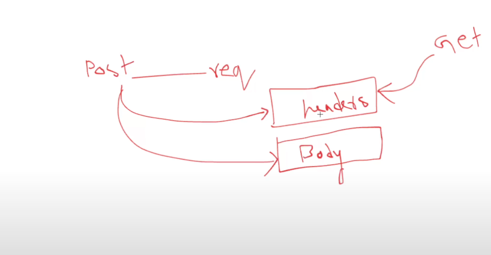

# 048 - Ecommerce Project (POST Request)(to create a Resource)


```go
func createProduct(w http.ResponseWriter, r *http.Request){
	w.Header().Set("Access-Control-Allow-Origin", "*") //? Here * means everyone can access
	w.Header().Set("Access-Control-Allow-Methods", "POST")
	w.Header().Set("Access-Control-Allow-Headers", "Content-Type")
	w.Header().Set("Content-Type", "application/json")

	if r.Method == "OPTIONS"{
		w.WriteHeader(200)
		return
	}

	if r.Method != http.MethodPost{ //?or r.Method != "POST"
		http.Error(w, "Please give me POST Request", 400)
		return
	}
	/*
	    1) Take body information(description, imageURL, price, titile) from r.body
		2) Create an instance using Product struct with the body information
		3) Append the instance to the productList
	*/ 

	var newProduct Product
	decoder := json.NewDecoder(r.Body)
	err := decoder.Decode(&newProduct)
	if err != nil{
		fmt.Println(err)
		http.Error(w, "Plz give me a valid json", 400)
		return
	}
	newProduct.ID = len(productList)+1
	productList = append(productList, newProduct)

	w.WriteHeader(201)
	encoder := json.NewEncoder(w)
	encoder.Encode(newProduct)
}
```
