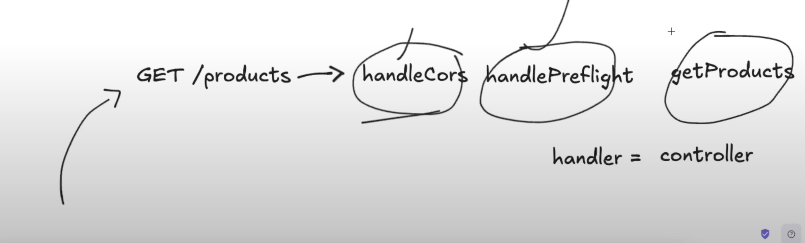

# 051 - Advanced Routing
go version need to be 1.22 or more, not less than this for Advanced Routing
**to check go version**: go version
```go
package main

import (
	"encoding/json"
	"fmt"
	"net/http"
) //?Here net is a package and http is a sub-package under net package

func handleCors(w http.ResponseWriter){
	w.Header().Set("Access-Control-Allow-Origin", "*") //? Here * means everyone can access
	w.Header().Set("Access-Control-Allow-Methods", "POST, GET, PUT, PATCH, OPTIONS")
	w.Header().Set("Access-Control-Allow-Headers", "Content-Type")
	w.Header().Set("Content-Type", "application/json")
}

func handlePreflightRequest(w http.ResponseWriter, r *http.Request){
	if r.Method == "OPTIONS"{
		w.WriteHeader(200)
	}
}

func helloHandler (w http.ResponseWriter, r *http.Request){
	fmt.Fprintln(w, "Hello World")
}

func aboutHandler(w http.ResponseWriter, r *http.Request){
	fmt.Fprintln(w, "I'm Somel. I'm youtuber. I'm software engineer")
}

type Product struct{
	ID int `json:"id"`
	Title string `json:"title"`
	Description string `json:"description"`
	Price float64 `json:"price"`
	ImgURL string `json:"imageURL"`
}

var productList []Product

func sendData(w http.ResponseWriter, data interface{}, statusCode int){
	w.WriteHeader(statusCode)
	encoder := json.NewEncoder(w)
	encoder.Encode(data)
}

func getProducts(w http.ResponseWriter, r *http.Request){ 
	handleCors(w)
	if r.Method == "OPTIONS"{
		w.WriteHeader(200)
		return
	}
	sendData(w, productList, 200)
}

func createProduct(w http.ResponseWriter, r *http.Request){

	handleCors(w)
	if r.Method == "OPTIONS"{
		w.WriteHeader(200)
		return
	}
	/*
	    1) Take body information(description, imageURL, price, titile) from r.body
		2) Create an instance using Product struct with the body information
		3) Append the instance to the productList
	*/ 

	var newProduct Product
	decoder := json.NewDecoder(r.Body)
	err := decoder.Decode(&newProduct)
	if err != nil{
		fmt.Println(err)
		http.Error(w, "Plz give me a valid json", 400)
		return
	}
	newProduct.ID = len(productList)+1
	productList = append(productList, newProduct)

	sendData(w, newProduct, 201)
	
}


func main(){
	mux := http.NewServeMux() //? Here mux is a Router. it will return an address of object
	mux.Handle("GET /hello", http.HandlerFunc(helloHandler)) //? route
	mux.Handle("GET /about", http.HandlerFunc(aboutHandler)) //? route
	mux.Handle("GET /products", http.HandlerFunc(getProducts))
	mux.Handle("OPTIONS /products", http.HandlerFunc(getProducts))
	mux.HandleFunc("POST /create-product", http.HandlerFunc(createProduct))
	mux.HandleFunc("OPTIONS /create-product", http.HandlerFunc(createProduct))
	fmt.Println("Server is running on: 3000")

	err := http.ListenAndServe(":3000", mux) //? return an Error(if there is an Error) or nil(if there is no Error)
	if err != nil{
		fmt.Println("Error starting the server: ", err)
	}
}

func init(){
	prdct1 := Product{
		ID: 1,
		Title: "Orange",
		Description: "Orange is Red. I Love Orange",
		Price: 100,
		ImgURL: "https://www.dole.com/sites/default/files/media/2025-01/oranges.png",
	}
	prdct2 := Product{
		ID: 2,
		Title: "Apple",
		Description: "Apple is Green. I eat Apple",
		Price: 40,
		ImgURL: "https://static.vecteezy.com/system/resources/thumbnails/012/086/172/small_2x/green-apple-with-green-leaf-isolated-on-white-background-vector.jpg",
	}
	prdct3 := Product{
		ID: 3,
		Title: "Banana",
		Description: "Banana is Boring. I hate Banana",
		Price: 5,
		ImgURL: "https://www.dole.com/sites/default/files/media/2025-01/banana-cavendish_0.png",
	}
	productList = append(productList, prdct1)
	productList = append(productList, prdct2)
	productList = append(productList, prdct3)

}
```

## middleWire
**Middleware** is code that runs between the incoming **HTTP request** and your final handler function. Think of it as a chain of functions that process the request/response before it reaches your business logic.
### How Middleware Works:
```bash
Request → Middleware 1 → Middleware 2 → Handler → Middleware 2 → Middleware 1 → Response
```

Here, **handleCors**, **handlePreflight** is **middleWire**
**getProducts** is a **handler-function**, which is called **handler** and also called **controller**.
handler = controller

**-----------------------------------------------------------------------------------------------------------**

**to run all files on a folder**: 
```bash
go run .
```

**------------------------------------------------------------------------------------------------------------**

http://localhost:3000/products/2
Here 2 is called **pathparameter**
