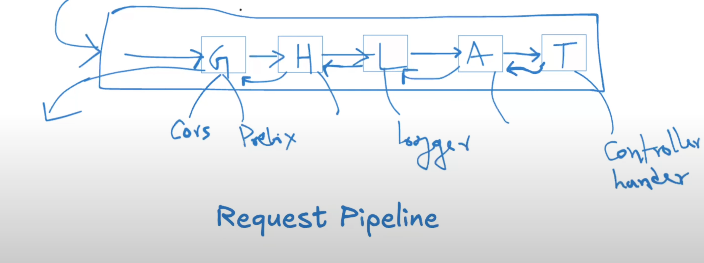

# 053 - Advanced Middleware
## Request Pipeline

### 1. Client sends request
- A browser, mobile app, or tool (like Postman) sends an HTTP request.
- Request includes method (GET, POST, …), headers, body, cookies, etc.

### 2. Go’s Server accepts it
- You usually start a server with:
```go
http.ListenAndServe(":3000", mux)
```
- Internally:
  - Go creates a **TCP listener** on port 3000.
  - For each new connection, it spins up a **goroutine** to handle that request.
  - The request is parsed into:
    - **http.Request** (all details of request: URL, method, headers, body)
    - **http.ResponseWriter** (an interface you write responses into)

### 3. Router / Mux
- The request is passed to a **ServeMux (multiplexer)** or **router**.
- It decides which **handler** function should run based on:
    - HTTP method (GET, POST, …)
    - Path (/hello, /products …)
```go
mux := http.NewServeMux()
mux.HandleFunc("/hello", helloHandler)
```

### 4. Middleware layers
Before the request hits your handler, it often flows through **middleware**:
- Logging (time, status codes)
- Authentication / JWT verification
- CORS headers
- Panic recovery
Each middleware decides:

- Pass request forward (next.ServeHTTP)
- OR short-circuit (e.g., block unauthorized requests)
Pipeline looks like:
```css
Request → Middleware A → Middleware B → Handler → Response
```

### 5. Handler execution
- Your handler is a function:
```go
func helloHandler(w http.ResponseWriter, r *http.Request) {
    fmt.Fprintln(w, "Hello, World!")
}
```
- Here:
- **r** = request details (method, URL, query, body).
- **w** = writer where you set status code, headers, and body.

### 6. Response pipeline
- Handler writes response via:
```go
w.Header().Set("Content-Type", "application/json")
w.WriteHeader(http.StatusOK)
fmt.Fprintln(w, `{"msg": "Hello"}`)
```
- Response travels back through middlewares (some may log or wrap it).
- Finally, it’s sent over TCP back to the client.

### 7. Lifecycle summary
1. Client → OS socket → Go’s HTTP server
2. Go runtime creates goroutine → parses request
3. Router finds matching handler
4. Middleware chain executes
5. Handler executes business logic
6. Response written → flows back
7. Connection closed (or reused for KeepAlive)

### 8. Visual Pipeline
```css
Browser/Client
     │
     ▼
Go HTTP Server (Listener)  
     │
     ▼
   Router (Mux) 
     │
     ▼
 ┌───────────────┐
 │ Middleware A  │ → Logging
 └───────────────┘
     │
 ┌───────────────┐
 │ Middleware B  │ → Auth / CORS
 └───────────────┘
     │
     ▼
   Handler (your logic)
     │
     ▼
ResponseWriter → back to Client
```