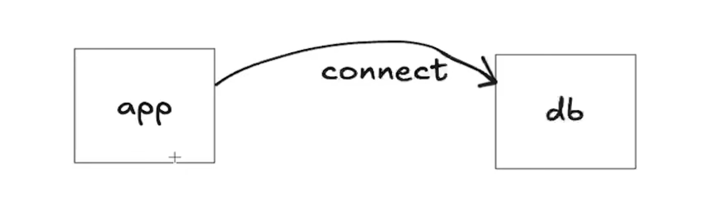

# 060 - Database Connection Setup
infra -> Infrastructure(DB, Redis, rabbitmq, kafka, file storage)

to use Database, we need a library, external library --> we will use **sqlx**

**Installing sqlx:**
[sqlx](https://github.com/jmoiron/sqlx)

**also need to install postgres library:**
[postgres](https://github.com/lib/pq)
infra/db --> connection.go
```go
package db

import (
	"fmt"

	"github.com/jmoiron/sqlx"
	_ "github.com/lib/pq"
)

func GetConnectionStirng() string {
	//? user -> postgres
	//? password -> 8808
	//? host -> localhost
	//? port -> 5432
	//? dbname -> ecommerce

	return "user=postgres password=8808 host=localhost port=5432 dbname=ecommerce"
}

func NewConnection() (*sqlx.DB, error) {
	dbSource := GetConnectionStirng()
	dbClient, err := sqlx.Connect("postgres", dbSource)
	if err != nil {
		fmt.Println(err)
		return nil, err
	}
	return dbClient, nil
}
```
