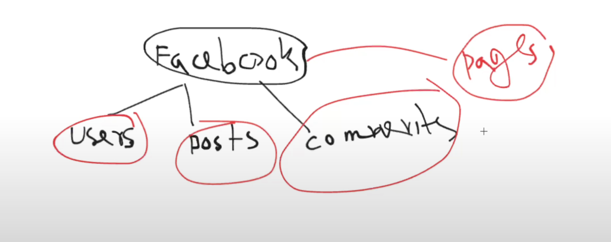

# Intro to Backend Development

**Server** means **computer**(public computer, anyone can access)

### The static Era - Early 1990 - Web 1.0
1) static html pages
2) Backend was not involved

## --------------web 3.0------------------------
### Server side Rendering - Mid 1990 - Early 2000
**Browser requests to the server, then server makes the file and returns the full file(full page)**
1) HTML + CSS sent from backend, dynamically generated HTML

### The Ajax Revolution - 2005 - 2010
1) API Introduction
2) API Endpoint
3) Starts the Backend Development

### Restful API and JSON - 2010
**REST** --> Representational State Transfer. is a Philosophy or blueprint or architectural style.
**RESTful** --> if anything follows the the priciple of **REST** then it is called **RESTful**.
Like there is a Web Service. when the web Service was built then if it was follow the Philosophy of REST then it is called RESTful.
**RESTfulService** --> the Service which is built based on **REST**

**Resource** --> is an Entity or Concept. A Resource is any piece of information or concept that can be named, identified and manipulated over the web.

Here users, posts, comments, pages are **Resource**

**State** --> Resource's current condition or situation.

**Representational(present in new way) State** --> it means to express the Resource's state in new way or in new format(JSON, xml, yaml, html, plain text, csv).

Here state is presented in way or in format which is JSON. Now JSON is the Representational State.

**Representational State Transfer** --> when backend Transfer the Representational state to the front then it is called **Representational State Transfer(REST)**

Resource(concept or information. Like facebook's posts, pages) -> state(Resource's current condition) -> Representational State(representing state in new way or format(JSON, xml, yml)) -> REST(Philosophy/rules/priciples/blueprint/architectural style. Founder is Roy Fielding) -> RESTful(follows the REST's rules) -> RESTful Service(making a service(like: website) using RESTful) -> REST Api(RESTful service has REST Api(API is built following the rules of REST's rules))

**API** --> Application Programming Interface. connector between Frontend and Backend.