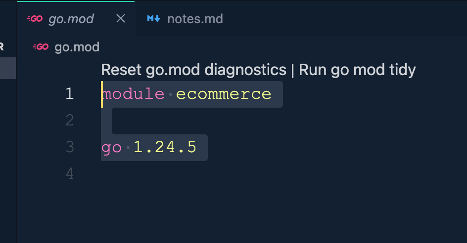

# OS or Go Server
**Creating a Module** --> go mod init ecommerce. This will create a go.mod file which will have:


```go
package main

import (
	"fmt"
	"net/http"
) //?Here net is a package and http is a sub-package under net package

func helloHandler (w http.ResponseWriter, r *http.Request){
	fmt.Fprintln(w, "Hello World")
}

func aboutHandler(w http.ResponseWriter, r *http.Request){
	fmt.Fprintln(w, "I'm Somel. I'm youtuber. I'm software engineer")
}

func main(){
	mux := http.NewServeMux() //? it will return an address of object
	mux.HandleFunc("/hello", helloHandler)
	mux.HandleFunc("/about", aboutHandler)
	fmt.Println("Server is running on: 3000")

	err := http.ListenAndServe(":3000", mux) //? return an Error(if there is an Error) or nil(if there is no Error)
	if err != nil{
		fmt.Println("Error starting the server: ", err)
	}
}
```

----------------------------------------------------------------------------------------------------------

**mux**: is Router
**"/hello"**: route
```go
package main

import (
	"fmt"
	"net/http"
) //?Here net is a package and http is a sub-package under net package

func helloHandler (w http.ResponseWriter, r *http.Request){
	fmt.Fprintln(w, "Hello World")
}

func aboutHandler(w http.ResponseWriter, r *http.Request){
	fmt.Fprintln(w, "I'm Somel. I'm youtuber. I'm software engineer")
}

func main(){
	mux := http.NewServeMux() //? Here mux is a Router. it will return an address of object
	mux.HandleFunc("/hello", helloHandler) //? route
	mux.HandleFunc("/about", aboutHandler) //? route
	fmt.Println("Server is running on: 3000")

	err := http.ListenAndServe(":3000", mux) //? return an Error(if there is an Error) or nil(if there is no Error)
	if err != nil{
		fmt.Println("Error starting the server: ", err)
	}
}
```


