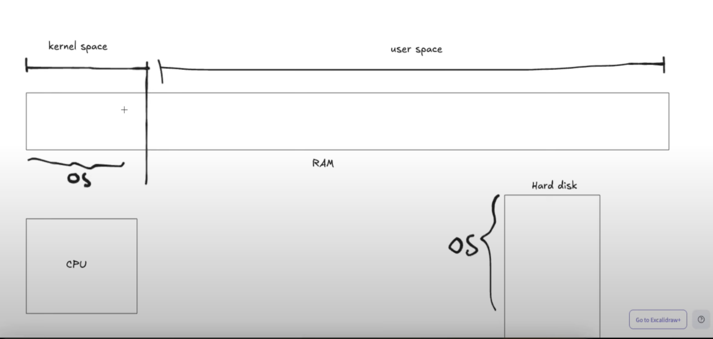

# 046 - Go Runtime(Mini Operating System)
**Creating go.mod file** --> go mod init sample-go
**To build main.go** --> go build main.go. It will create a main Binary file and will save on Hard Disk.
**To run main.go after build(this will create a go process)** --> ./main. Binary file will be load on RAM(Code Segment, Data Segment).

After computer on,
OS code will load on RAM from Hard Disk. Cpu will then execute the OS Code Line by Line. After that CPU will take control of all things: Hard Disk, CPU, RAM. Now all the things of the computer will be handled by OS now.

**Kernel Space** --> RAM Space for Operating System's Code Base. Any one from user space can not access this code base. Manages Hardware, Network, File System, Process, Memory.

**User Space** --> Applicaton and Process runs under this space. If there is a process running on user space and if it needs any file then user space(RAM) requests Kernel space for the file, this request is called System call(sys call).

If a software runs then a Go Process will run. Process will allocate some RAM space from User Space. 

Main thread needs to start(must) if Process starts(means main thread starts, process starts). 
When main thread starts, at first Go runtime code's runs, even before the main function and init function. Main thread runs the Go Runtime. Whwn Go Runtime runs, it will do:
1) initialize go scheduler.
2) will request a system call to the Kernel. will tell i want to create epoll. 
   **go runtime -> sys call -> Kernel -> epoll create**.
   **what is Epoll?** -> Epoll is feature of OS means feature of Kernel. Epoll has 3 operations:
   1) epoll_create
   2) epoll_control
   3) epoll_wait
   
   when thread requests kernel to read any file, then using Epoll feature kernel sleeps that thread immediately. then takings some time, kernel ready the file descriptor and mark that it is ready. 
   then kernel awake that sleeping thread, and with the help of epoll_wait returns that file descriptor(work as a token).
   epoll_create meand create a seperate OS Thread. 
   create a seperate thread(it only do epoll_wait).
   

3) set up GC(Garbage Collector)
   another OS Thread will be created and this thread will run the GC.
   

## Go Scheduling
Go runtime follows a rule: M:P:G(M: OS Thread, P: Logical Processor, G: go routines)
1 core --> 2 Logical CPUs.
if there is 2 core then:
4:4:16
Here 4 OS Threads run 4 Logical/Virtual Processor and these 4 Processors run 16 go routine(Dynamic) concurrently.

for each Processor has queue(it is called local run queue. Has slot 256).
There is two types of run queue(store go routine in queue):
1) local Run Queue
2) Global Run Queue(Dynamic)

after running go runtime and finishing all the important works of go runtime, now all init functions will be run. after that a go routine(lightweight thread) will be created.
after finishing the work of code Segment, data Segment the go runtime will be run on stack. after the work done for go runtime, it will create a go routine, which is called main go routine.
for this go routine a stack will be created on the heap, which size is 2KB, size is dynamic, go runtime can increase the if it wants. 

under this stack a stack frame will be created for main function. then this go routine will be stored on a run queue of a Logical Processor.

