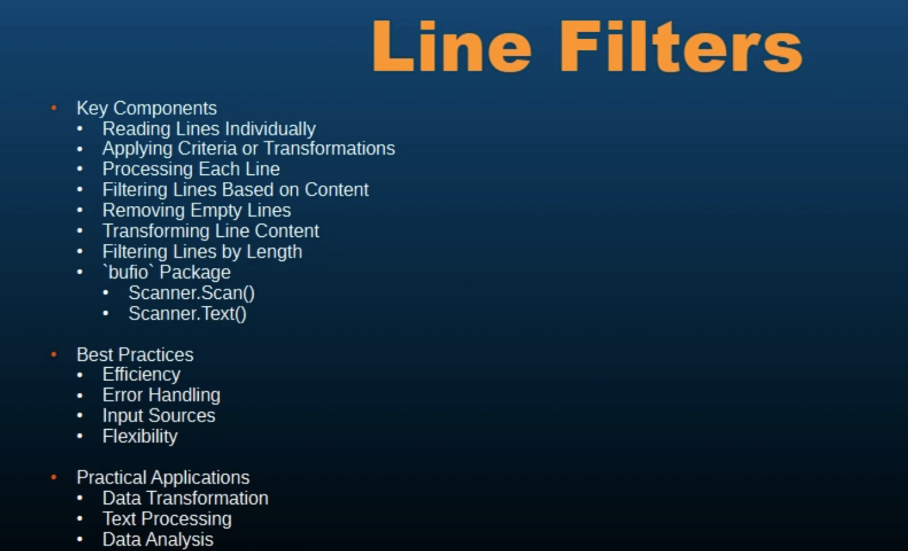

# 085 - Line Filters
Line filtering refers to the process of processing or modifying lines of text based on specific criteria.

It involves reading text line by line and applying certain operations or conditions to each line.

This is a common task in text processing, data cleaning, and file manipulation.

Some examples of line filtering are:
- filtering lines based on content
- removing empty lines
- transform line content

```exmaple.text
Some important info.

Another important piece of data.
This is going to be important.

Please finish this, this is important.

Go is an important language to learn in this era.

Go is valuable addition to programming.
```
```go
package main

import (
	"bufio"
	"fmt"
	"os"
	"strings"
)

func main() {
	file, err := os.Open("example.txt")
	if err != nil {
		fmt.Println("Error opening file: ", err)
		return
	}

	defer file.Close()

	scanner := bufio.NewScanner(file)

	//? Keyword to filter lines
	keyword := "important"

	//? Read and filter lines
	for scanner.Scan() {
		line := scanner.Text()
		if strings.Contains(line, keyword) {
			fmt.Println("Filtered Line: ", line)
		}
	}

	err = scanner.Err()
	if err != nil {
		fmt.Println("Error reading file: ", err)
		return
	}
}
```
```bash
Filtered Line:  Some important info.
Filtered Line:  Another important piece of data.
Filtered Line:  This is going to be important.
Filtered Line:  Please finish this, this is important.
Filtered Line:  Go is an important language to learn in this era.
```

---------------------------------------------------------------------------------------------------------------------------

```exmaple.text
Some important info.

Another important piece of data.
This is going to be important.

Please finish this, this is important.

Go is an important language to learn in this era.

Go is valuable addition to programming.
```
```go
package main

import (
	"bufio"
	"fmt"
	"os"
	"strings"
)

func main() {
	file, err := os.Open("example.txt")
	if err != nil {
		fmt.Println("Error opening file: ", err)
		return
	}

	defer file.Close()

	scanner := bufio.NewScanner(file)

	//? Keyword to filter lines
	keyword := "important"

	//? Read and filter lines
	for scanner.Scan() {
		line := scanner.Text()
		if strings.Contains(line, keyword) {
			updatesLine := strings.ReplaceAll(line, keyword, "necessary")
			fmt.Println("Filtered Line: ", line)
			fmt.Println("Updated line: ", updatesLine)
		}
	}

	err = scanner.Err()
	if err != nil {
		fmt.Println("Error reading file: ", err)
		return
	}
}
```
```bash
Filtered Line:  Some important info.
Updated line:  Some necessary info.
Filtered Line:  Another important piece of data.
Updated line:  Another necessary piece of data.
Filtered Line:  This is going to be important.
Updated line:  This is going to be necessary.
Filtered Line:  Please finish this, this is important.
Updated line:  Please finish this, this is necessary.
Filtered Line:  Go is an important language to learn in this era.
Updated line:  Go is an necessary language to learn in this era.
```

---------------------------------------------------------------------------------------------------------------------------

```text
Some important info.

Another important piece of data.
This is going to be important.

Please finish this, this is important.

Go is an important language to learn in this era.

Go is valuable addition to programming.
```
```go
package main

import (
	"bufio"
	"fmt"
	"os"
	"strings"
)

func main() {
	file, err := os.Open("example.txt")
	if err != nil {
		fmt.Println("Error opening file: ", err)
		return
	}

	defer file.Close()

	scanner := bufio.NewScanner(file)

	lineNumber := 1

	//? Keyword to filter lines
	keyword := "important"

	//? Read and filter lines
	for scanner.Scan() {
		line := scanner.Text()
		if strings.Contains(line, keyword) {
			updatesLine := strings.ReplaceAll(line, keyword, "necessary")
			fmt.Printf("%d Filtered Line: %v\n", lineNumber, line)
			fmt.Printf("%d Updated line: %v\n", lineNumber, updatesLine)
			lineNumber++
		}
	}

	err = scanner.Err()
	if err != nil {
		fmt.Println("Error reading file: ", err)
		return
	}
}
```
```bash
1 Filtered Line: Some important info.
1 Updated line: Some necessary info.
2 Filtered Line: Another important piece of data.
2 Updated line: Another necessary piece of data.
3 Filtered Line: This is going to be important.
3 Updated line: This is going to be necessary.
4 Filtered Line: Please finish this, this is important.
4 Updated line: Please finish this, this is necessary.
5 Filtered Line: Go is an important language to learn in this era.
5 Updated line: Go is an necessary language to learn in this era.
```

---------------------------------------------------------------------------------------------------------------------------

```go
package main

import (
	"bufio"
	"fmt"
	"os"
	"strings"
)

func main() {
	file, err := os.Open("example.txt")
	if err != nil {
		fmt.Println("Error opening file: ", err)
		return
	}

	defer file.Close()

	scanner := bufio.NewScanner(file)

	lineNumber := 1

	//? Keyword to filter lines
	keyword := "important"

	//? Read and filter lines
	for scanner.Scan() {
		line := scanner.Text()
		if strings.Contains(line, keyword) {
			updatesLine := strings.ReplaceAll(line, keyword, "necessary")
			fmt.Printf("%d Filtered Line: %v\n", lineNumber, line)
			lineNumber++
			fmt.Printf("%d Updated line: %v\n", lineNumber, updatesLine)
			lineNumber++
		}
	}

	err = scanner.Err()
	if err != nil {
		fmt.Println("Error reading file: ", err)
		return
	}
}
```
```bash
1 Filtered Line: Some important info.
2 Updated line: Some necessary info.
3 Filtered Line: Another important piece of data.
4 Updated line: Another necessary piece of data.
5 Filtered Line: This is going to be important.
6 Updated line: This is going to be necessary.
7 Filtered Line: Please finish this, this is important.
8 Updated line: Please finish this, this is necessary.
9 Filtered Line: Go is an important language to learn in this era.
10 Updated line: Go is an necessary language to learn in this era.
```

**---------------------------------------------------------------------------------------------------------------------------**

When using line filters, there are certain best practices that we need to consider:
- Use buffered input/output for efficient reading of input, especially when dealing with large volumes of data
- Must use scanner.Err(), when you are using scanner.Scan()

