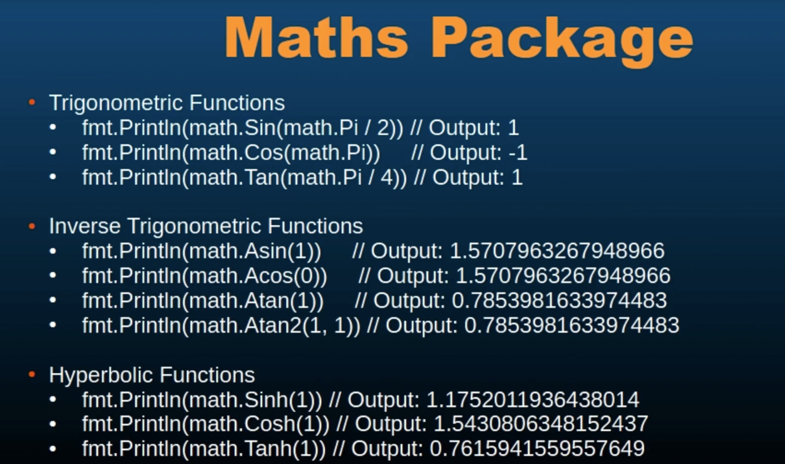

# 100 - Math Package

The Math Package in Go, provides basic constants and mathematical functions for common tasks such as computing square roots, trigonometric functions, logarithms, and more.

This Package is essential for many applications, ranging from simple arithmetic operations to complex scientific computations.

Talking about constants, the Math Package defiens several constants that are frequently used in mathematical computations, like:

- pie
- e, the base of natural algorithms
- Phi, the golden ratio
- abs, absolute
- math.sqrt
- math.pow
- math.exp
  

**--------------------------------------------------------------------------------------------------------------------------------**

#### Constants

    p := math.Pi

    e := math.E

    ph := math.Phi

    sqrt2 := math.Sqrt2

    sqrtE := math.SqrtE

    sqrtPi := math.SqrtPi

    sqrtPhi := math.SqrtPhi

    ln2 := math.Ln2

    ln10 := math.Ln10

    log2E := math.Log2E

    log10E := math.Log10E

**--------------------------------------------------------------------------------------------------------------------------------**

#### Basic Mathematical Functions

- **Absolute Value**

func Abs(x float64) float64

fmt.Println(math.Abs(-3.14)) // Output: 3.14

- **Square Root**

func Sqrt(x float64) float64

fmt.Println(math.Sqrt(16)) // Output: 4

- **Power**

func Pow(x, y float64) float64

fmt.Println(math.Pow(2, 3)) // Output: 8

- **Exponential**

func Exp(x float64) float64

fmt.Println(math.Exp(1)) // Output: 2.718281828459045

- **Logarithms**

func Log(x float64) float64 // Natural logarithm

func Log10(x float64) float64 // Base-10 logarithm

fmt.Println(math.Log(math.E)) // Output: 1

fmt.Println(math.Log10(100)) // Output: 2

**--------------------------------------------------------------------------------------------------------------------------------**

#### Trigonometric Functions

func Sin(x float64) float64

func Cos(x float64) float64

func Tan(x float64) float64

fmt.Println(math.Sin(math.Pi / 2)) // Output: 1

fmt.Println(math.Cos(math.Pi)) // Output: -1

fmt.Println(math.Tan(math.Pi / 4)) // Output: 1

- **Inverse Trigonometric Functions**

func Asin(x float64) float64

func Acos(x float64) float64

func Atan(x float64) float64

func Atan2(y, x float64) float64

fmt.Println(math.Asin(1)) // Output: 1.5707963267948966

fmt.Println(math.Acos(0)) // Output: 1.5707963267948966

fmt.Println(math.Atan(1)) // Output: 0.7853981633974483

fmt.Println(math.Atan2(1, 1)) // Output: 0.7853981633974483

- **Hyperbolic Functions**

func Sinh(x float64) float64

func Cosh(x float64) float64

func Tanh(x float64) float64

fmt.Println(math.Sinh(1)) // Output: 1.1752011936438014

fmt.Println(math.Cosh(1)) // Output: 1.5430806348152437

fmt.Println(math.Tanh(1)) // Output: 0.7615941559557649

**--------------------------------------------------------------------------------------------------------------------------------**

#### Special Functions

func Gamma(x float64) float64

fmt.Println(math.Gamma(0.5)) // Output: 1.772453850905516

func Erf(x float64) float64

func Erfc(x float64) float64

fmt.Println(math.Erf(1)) // Output: 0.8427007929497149

fmt.Println(math.Erfc(1)) // Output: 0.15729920705028513

**--------------------------------------------------------------------------------------------------------------------------------**

#### Rounding Functions

- **Ceiling**

func Ceil(x float64) float64

fmt.Println(math.Ceil(1.3)) // Output: 2

- **Floor**

func Floor(x float64) float64

fmt.Println(math.Floor(1.7)) // Output: 1

- **Round**

func Round(x float64) float64

fmt.Println(math.Round(1.5)) // Output: 2

**--------------------------------------------------------------------------------------------------------------------------------**

#### Utility Functions

- **Minimum and Maximum**

func Min(x, y float64) float64

func Max(x, y float64) float64

Example:

fmt.Println(math.Min(1, 2)) // Output: 1

fmt.Println(math.Max(1, 2)) // Output: 2

- **Hypotenuse**

func Hypot(p, q float64) float64

fmt.Println(math.Hypot(3, 4)) // Output: 5
