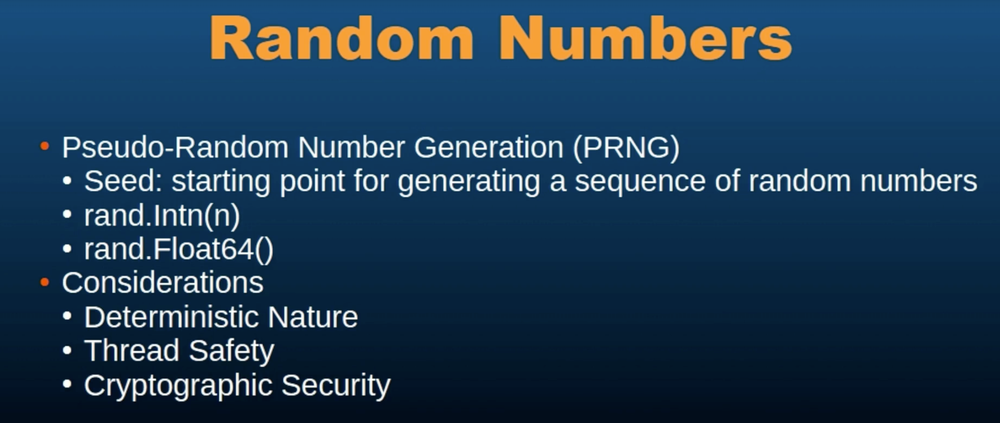

# 77 - Random Numbers

Random Numbers play a crusial role in many applications, from simulations and games to cryptography
and statistical sampling.

Generating random Numbers involves using the math Rand package, which provides functions for generating pseudo random and cryptographically secure random Numbers.

Now, when we are talking about random Numbers, we have to understand seeding and seed.

A seed is a starting point for generating a sequence of random Numbers.

There is a cocept of True random Numbers and pseudo random Numbers.
- True random Numbers are truly random
- Pseudo random Numbers are generated by algorithms

```go
package main

import (
	"fmt"
	"math/rand/v2"
)

func main() {
    // from 0 to 100 
    // ntN returns, as an int, a pseudo-random number in the half-open interval [0,n) from the default Source. It panics if n <= 0.
	fmt.Println(rand.IntN(101))
}
```

**-----------------------------------------------------------------------------------------------------------------------**

## getting Fixed output -> using seed
```go
package main

import (
	"fmt"
	"math/rand"
)

func main() {
	val := rand.New(rand.NewSource(42))
	fmt.Println(val.Intn(101))
}
```


**-----------------------------------------------------------------------------------------------------------------------**

```go
package main

import (
	"fmt"
	"math/rand"
	"time"
)

func main() {
	val := rand.New(rand.NewSource(time.Now().Unix()))
	fmt.Println(val.Intn(101))
}
```


**-----------------------------------------------------------------------------------------------------------------------**

## Random floating point number
```go
package main

import (
	"fmt"
	"math/rand"
)

func main() {
	fmt.Println(rand.Float64()) //? between 0.0(inclusive) and 1.0(exclusive)
}
```

**-----------------------------------------------------------------------------------------------------------------------**

## making a Dice game
```go
package main

import (
	"fmt"
	"math/rand"
)

func main() {
	for {
		//? show the menu
		fmt.Println("Welcome to the Dice Game!")
		fmt.Println("1. Roll the Dice")
		fmt.Println("2. Exit")
		fmt.Print("Enter your Choice(1 or 2)")
		var choice int
		_, err := fmt.Scan(&choice)
		if err!=nil || (choice !=1 && choice != 2) {
			fmt.Println("Invalid choice, please enter 1 or 2.")
			continue;
		}
		if choice == 2 {
			fmt.Println("Thanks for playing! Goodbye.")
			break;
		}

		die1 := rand.Intn(6)+1
		die2 := rand.Intn(6)+1

		//? show the results
		fmt.Printf("You rolled a %d and a %d\n", die1, die2)
		fmt.Println("Total is: ", die1 + die2)

		//? Ask the user if user want to roll again
		fmt.Println("Do you want to roll again? (y/n): ")
		var rollAgain string
		_, err = fmt.Scan(&rollAgain)
		if err != nil || (rollAgain != "y" && rollAgain != "n") {
			fmt.Print("Invalid input, assuming no. ")
			break
		}
		if rollAgain == "n" {
			fmt.Println("Thanks for playing! Goodbye.")
			break;
		}
	}
}
```