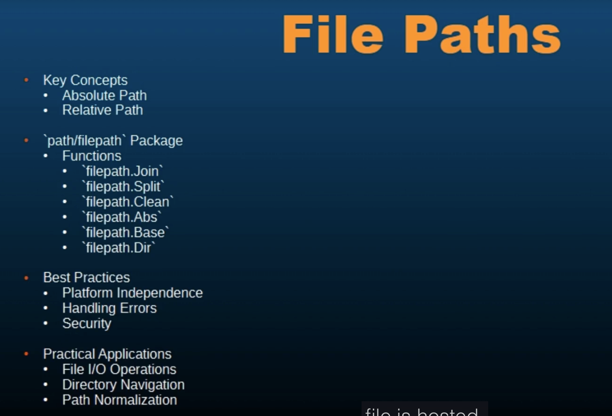

# 086 - File Paths
In software Development, file paths are essential for locating and referencing files and directories within a file system.

Understanding how to work with file paths is crucial for performing operations, such as reading from files, writing to files, and navigating through directories programmatically.

When talking about file paths, we have some concepts like:
1. Absolute path
   Absolute path specifies the complete path from the root directory.
2. Relative path
   Relative to the current working directory

```go
package main

import (
	"fmt"
	"path/filepath"
)

func main() {
	// relativePath := "./data/file.txt"
	// absolutePath := "/home/user/docs/file.txt"

	//? join paths using filePath.join
	joinedPath := filepath.Join("downloads", "file.zip")
	fmt.Println("Joined Path: ", joinedPath)
}
```
```bash
Joined Path:  downloads/file.zip
```

----------------------------------------------------------------------------------------------------------------------------

```go
package main

import (
	"fmt"
	"path/filepath"
)

func main() {
	// relativePath := "./data/file.txt"
	// absolutePath := "/home/user/docs/file.txt"

	//? join paths using filePath.join
	joinedPath := filepath.Join("home", "Documents", "downloads", "file.zip")
	fmt.Println("Joined Path: ", joinedPath)
}
```
```bash
Joined Path:  home/Documents/downloads/file.zip
```

---------------------------------------------------------------------------------------------------------------------------

```go
package main

import (
	"fmt"
	"path/filepath"
)

func main() {
	// relativePath := "./data/file.txt"
	// absolutePath := "/home/user/docs/file.txt"

	//! join paths using filePath.join
	joinedPath := filepath.Join("home", "Documents", "downloads", "file.zip")
	fmt.Println("Joined Path: ", joinedPath)

	//! filepath.Clean()
	//? it is going to clean the path, even if we are giving it a mixed path or a or an incorrect path,
	//? it wil try to correct that.
	normalizedPath := "./data/../data/file.txt"
	fmt.Println("Normalized Path: ", normalizedPath)
}
```
```bash
Joined Path:  home/Documents/downloads/file.zip
Normalized Path:  ./data/../data/file.txt
```

---------------------------------------------------------------------------------------------------------------------------

## We have a long path and we want to extract the directory part and the file part from that file path -> using filepath.Split()
```go
package main

import (
	"fmt"
	"path/filepath"
)

func main() {
	// relativePath := "./data/file.txt"
	// absolutePath := "/home/user/docs/file.txt"
	
	dir, file := filepath.Split("/home/user/docs/file.txt")
	fmt.Println("File: ", file)
	fmt.Println("Path: ", dir)
}
```
```bash
File:  file.txt
Path:  /home/user/docs/
```

**---------------------------------------------------------------------------------------------------------------------------**

## filepath.Base() -> returns last file name or directory
```go
package main

import (
	"fmt"
	"path/filepath"
)

func main() {
	// relativePath := "./data/file.txt"
	// absolutePath := "/home/user/docs/file.txt"
	
	fmt.Println(filepath.Base("/home/user/docs/"))
}
```
```bash
docs
```

---------------------------------------------------------------------------------------------------------------------------

```go
package main

import (
	"fmt"
	"path/filepath"
)

func main() {
	// relativePath := "./data/file.txt"
	// absolutePath := "/home/user/docs/file.txt"

	fmt.Println(filepath.Base("/home/user/docs/file.txt"))
}
```
```bash
file.txt
```

**---------------------------------------------------------------------------------------------------------------------------**

## checking a path is absolute path or not
```go
package main

import (
	"fmt"
	"path/filepath"
)

func main() {
	relativePath := "./data/file.txt"
	absolutePath := "/home/user/docs/file.txt"

	fmt.Println(filepath.IsAbs(relativePath))
	fmt.Println(filepath.IsAbs(absolutePath))
}
```
```bash
false
true
```

**---------------------------------------------------------------------------------------------------------------------------**

## extracting the extension of the file -> filepath.Ext()
```go
package main

import (
	"fmt"
	"path/filepath"
)

func main() {
	_, file := filepath.Split("/home/user/docs/file.txt")
	fmt.Println(filepath.Ext(file))
}
```
```bash
.txt
```

---------------------------------------------------------------------------------------------------------------------------

```go
package main

import (
	"fmt"
	"path/filepath"
	"strings"
)

func main() {
	_, file := filepath.Split("/home/user/docs/file.txt")
	
	fmt.Println(strings.TrimSuffix(file, filepath.Ext(file)))
}
```
``` bash
file
```

**---------------------------------------------------------------------------------------------------------------------------**

## finding a path that is relative to another path
```go
package main

import (
	"fmt"
	"path/filepath"
)

func main() {
	rel, err := filepath.Rel("a/b", "a/b/t/file")
	if err != nil {
		panic(err)
	}
	fmt.Println(rel)
}
```
```bash
t/file
```

---------------------------------------------------------------------------------------------------------------------------

```go
package main

import (
	"fmt"
	"path/filepath"
)

func main() {
	rel, err := filepath.Rel("a/c", "a/b/t/file")
	if err != nil {
		panic(err)
	}
	fmt.Println(rel)
}
```
```bash
../b/t/file
```

**---------------------------------------------------------------------------------------------------------------------------**

## converting a relative path to absolute path
```go
package main

import (
	"fmt"
	"path/filepath"
)

func main() {
	relativePath := "./data/file.txt"
	// absolutePath := "/home/user/docs/file.txt"

	fmt.Println("Relative Path: ", relativePath)

	absPath, err := filepath.Abs(relativePath)
	if err != nil {
		fmt.Println("Error: ", err)
		return
	}else{
		fmt.Println("Absolute Path: ", absPath)
	}
}
```
```bash
Relative Path:  ./data/file.txt
Absolute Path:  /Users/progsomel/Library/Mobile Documents/com~apple~CloudDocs/ProgSomel/Study/Programming/backend-development/golang/002 - Go Programming - Intermediate/086 - File Paths/data/file.txt
```
