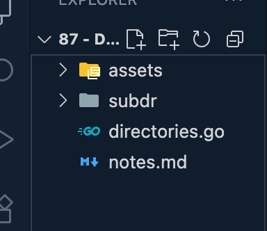

# 87 - Directories
Directories or folder are containers used to organize files on computer's file system.

In software development, understanding how to work with Directories programmatically is essential for task such as creating, reading, navigating, and deleting Directories.

In Go, the OS package provides functions for interacting with Directories and performing file system operations.
[chmod](https://chmod-calculator.com/)

## creating Directory
```go
package main

import (
	"os"
)

func checkError(err error) {
	if err != nil {
		panic(err)
	}
}

func main() {
	// err := os.Mkdir("subdr", 0755)
	// checkError(err)
	checkError(os.Mkdir("subdr", 0755))
}
```


------------------------------------------------------------------------------------------------------------------------------

```go
package main

import (
	"os"
)

func checkError(err error) {
	if err != nil {
		panic(err)
	}
}

func main() {
	// err := os.Mkdir("subdr", 0755)
	// checkError(err)
	checkError(os.Mkdir("subdr1", 0755))
}
```


**------------------------------------------------------------------------------------------------------------------------------**

## removing Directory
```go
package main

import (
	"os"
)

func checkError(err error) {
	if err != nil {
		panic(err)
	}
}

func main() {
	// err := os.Mkdir("subdr", 0755)
	// checkError(err)
	checkError(os.Mkdir("subdir1", 0755))
	defer os.RemoveAll("subdir1")
}
```


**------------------------------------------------------------------------------------------------------------------------------**

```go
package main

import (
	"os"
)

func checkError(err error) {
	if err != nil {
		panic(err)
	}
}

func main() {
	checkError(os.Mkdir("subdir", 0755))
	err := os.WriteFile("subdir/file", []byte(""), 0755)
	checkError(err)

}
```


**------------------------------------------------------------------------------------------------------------------------------**

## os.MkdirAll() -> creates multiple Directories, nested Directories -> those multiple Directories are nested inside each other
```go
package main

import (
	"os"
)

func checkError(err error) {
	if err != nil {
		panic(err)
	}
}

func main() {
	checkError(os.MkdirAll("subdir/parent/child", 0755))
}
```


------------------------------------------------------------------------------------------------------------------------------

```go
package main

import (
	"os"
)

func checkError(err error) {
	if err != nil {
		panic(err)
	}
}

func main() {
	checkError(os.MkdirAll("subdir/parent/child1", 0755))
	checkError(os.MkdirAll("subdir/parent/child2", 0755))
	checkError(os.MkdirAll("subdir/parent/child3", 0755))
}
```


------------------------------------------------------------------------------------------------------------------------------

```go
package main

import (
	"os"
)

func checkError(err error) {
	if err != nil {
		panic(err)
	}
}

func main() {
	checkError(os.MkdirAll("subdir/parent/child1", 0755))
	checkError(os.MkdirAll("subdir/parent/child2", 0755))
	checkError(os.MkdirAll("subdir/parent/child3", 0755))
	os.WriteFile("subdir/parent/file", []byte(""), 07555)
	os.WriteFile("subdir/parent/child1/file", []byte(""), 07555)
}
```


**------------------------------------------------------------------------------------------------------------------------------**

## read Directory -> os.ReadDir
```go
package main

import (
	"fmt"
	"os"
)

func checkError(err error) {
	if err != nil {
		panic(err)
	}
}

func main() {
	checkError(os.MkdirAll("subdir/parent/child1", 0755))
	checkError(os.MkdirAll("subdir/parent/child2", 0755))
	checkError(os.MkdirAll("subdir/parent/child3", 0755))
	os.WriteFile("subdir/parent/file", []byte(""), 07555)
	os.WriteFile("subdir/parent/child1/file", []byte(""), 07555)

	result, err := os.ReadDir("subdir/parent")
	checkError(err)
	fmt.Println(result)
}
```
```bash
[d child1/ d child2/ d child3/ - file]
```

------------------------------------------------------------------------------------------------------------------------------

```go
package main

import (
	"fmt"
	"os"
)

func checkError(err error) {
	if err != nil {
		panic(err)
	}
}

func main() {
	checkError(os.MkdirAll("subdir/parent/child1", 0755))
	checkError(os.MkdirAll("subdir/parent/child2", 0755))
	checkError(os.MkdirAll("subdir/parent/child3", 0755))
	os.WriteFile("subdir/parent/file", []byte(""), 07555)
	os.WriteFile("subdir/parent/child1/file", []byte(""), 07555)

	result, err := os.ReadDir("subdir/parent")
	checkError(err)
	for _, entry := range result {
		fmt.Println(entry)
	}
}
```
```bash
d child1/
d child2/
d child3/
- file
```

------------------------------------------------------------------------------------------------------------------------------

```go
package main

import (
	"fmt"
	"os"
)

func checkError(err error) {
	if err != nil {
		panic(err)
	}
}

func main() {
	checkError(os.MkdirAll("subdir/parent/child1", 0755))
	checkError(os.MkdirAll("subdir/parent/child2", 0755))
	checkError(os.MkdirAll("subdir/parent/child3", 0755))
	os.WriteFile("subdir/parent/file", []byte(""), 07555)
	os.WriteFile("subdir/parent/child1/file", []byte(""), 07555)

	result, err := os.ReadDir("subdir/parent")
	checkError(err)
	for _, entry := range result {
		fmt.Println(entry.Name(), entry.IsDir())
	}
}
```
```bash
child1 true
child2 true
child3 true
file false
```

**------------------------------------------------------------------------------------------------------------------------------**

## change Directory
```go
package main

import (
	"fmt"
	"os"
)

func checkError(err error) {
	if err != nil {
		panic(err)
	}
}

func main() {
	checkError(os.MkdirAll("subdir/parent/child1", 0755))
	checkError(os.MkdirAll("subdir/parent/child2", 0755))
	checkError(os.MkdirAll("subdir/parent/child3", 0755))
	os.WriteFile("subdir/parent/file", []byte(""), 07555)
	os.WriteFile("subdir/parent/child1/file", []byte(""), 07555)

	result, err := os.ReadDir("subdir/parent")
	checkError(err)
	for _, entry := range result {
		fmt.Println(entry.Name(), entry.IsDir())
	}

	fmt.Println("------------------------------------------------")

	err = os.Chdir("subdir/parent/child1")
	checkError(err)

	result, err = os.ReadDir(".")
	checkError(err)
	fmt.Println(result)
}
```
```bash
child1 true
child2 true
child3 true
file false
------------------------------------------------
[- file]
```

------------------------------------------------------------------------------------------------------------------------------

```go
package main

import (
	"fmt"
	"os"
)

func checkError(err error) {
	if err != nil {
		panic(err)
	}
}

func main() {
	checkError(os.MkdirAll("subdir/parent/child1", 0755))
	checkError(os.MkdirAll("subdir/parent/child2", 0755))
	checkError(os.MkdirAll("subdir/parent/child3", 0755))
	os.WriteFile("subdir/parent/file", []byte(""), 07555)
	os.WriteFile("subdir/parent/child1/file", []byte(""), 07555)

	result, err := os.ReadDir("subdir/parent")
	checkError(err)
	for _, entry := range result {
		fmt.Println(entry.Name(), entry.IsDir())
	}

	fmt.Println("------------------------------------------------")

	err = os.Chdir("subdir/parent/child1")
	checkError(err)

	result, err = os.ReadDir(".")
	checkError(err)
	fmt.Println(result)

	fmt.Println("------------------------------------------------")
	err = os.Chdir("../../../")
	checkError(err)
	result, err = os.ReadDir(".")
	checkError(err)
	fmt.Println(result)

}
```
```bash
child1 true
child2 true
child3 true
file false
------------------------------------------------
[- file]
------------------------------------------------
[d assets/ - directories.go - notes.md d subdir/]
```

**------------------------------------------------------------------------------------------------------------------------------**

## Getting working Directory -> os.Getwd()
```go
package main

import (
	"fmt"
	"os"
)

func checkError(err error) {
	if err != nil {
		panic(err)
	}
}

func main() {
	checkError(os.MkdirAll("subdir/parent/child1", 0755))
	checkError(os.MkdirAll("subdir/parent/child2", 0755))
	checkError(os.MkdirAll("subdir/parent/child3", 0755))
	os.WriteFile("subdir/parent/file", []byte(""), 07555)
	os.WriteFile("subdir/parent/child1/file", []byte(""), 07555)

	result, err := os.ReadDir("subdir/parent")
	checkError(err)
	for _, entry := range result {
		fmt.Println(entry.Name(), entry.IsDir())
	}

	fmt.Println("------------------------------------------------")

	err = os.Chdir("subdir/parent/child1")
	checkError(err)

	result, err = os.ReadDir(".")
	checkError(err)
	fmt.Println(result)

	fmt.Println("------------------------------------------------")
	err = os.Chdir("../../../")
	checkError(err)
	result, err = os.ReadDir(".")
	checkError(err)
	fmt.Println(result)

	fmt.Println("------------------------------------------------")
	
	dir, err := os.Getwd()
	checkError(err)
	fmt.Println(dir)
}
```
```bash
child1 true
child2 true
child3 true
file false
------------------------------------------------
[- file]
------------------------------------------------
[d assets/ - directories.go - notes.md d subdir/]
------------------------------------------------
/Users/progsomel/Library/Mobile Documents/com~apple~CloudDocs/ProgSomel/Study/Programming/backend-development/golang/002 - Go Programming - Intermediate/87 - Directories
```

**------------------------------------------------------------------------------------------------------------------------------**

## to work with Directories we have another package instead of OS, is filepath
### filepath.Walk and filepath.WalkDir
difference between these two is that Walk dir is often preferred for performance reasons
```go
package main

import (
	"fmt"
	"os"
	"path/filepath"
)

func checkError(err error) {
	if err != nil {
		panic(err)
	}
}

func main() {
	pathFile := "subdir/parent"
	err := filepath.WalkDir(pathFile, func(path string, d os.DirEntry, err error) error {
		checkError(err)
		fmt.Println(path)
		return nil
	})
	checkError(err)
}
```
```bash
subdir/parent
subdir/parent/child1
subdir/parent/child1/file
subdir/parent/child2
subdir/parent/child3
subdir/parent/file
```

------------------------------------------------------------------------------------------------------------------------------

```go
package main

import (
	"fmt"
	"os"
	"path/filepath"
)

func checkError(err error) {
	if err != nil {
		panic(err)
	}
}

func main() {
	pathFile := "subdir/parent"
	err := filepath.WalkDir(pathFile, func(path string, d os.DirEntry, err error) error {
		checkError(err)
		fmt.Println(path)
		return nil
	})
	checkError(err)

    // checkError(os.RemoveAll("subdir"))
	checkError(os.RemoveAll("./subdir"))
}
```
```bash
subdir/parent/child1/file
subdir/parent/child2
subdir/parent/child3
subdir/parent/file
```