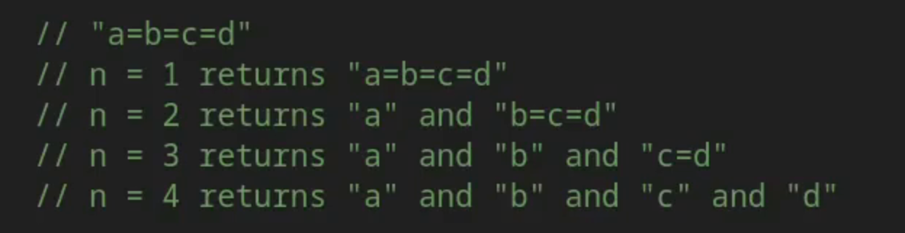

# 92 - Environment Variables
Environment Variables are key value pairs that are part of the Environment in which a process runs.
They provide a convenient way to process configuration information, credentials, and other runtime parameters to applications without hard coding those values into the application itself.

In Go, Environment, Variables are accessed through the OS package.

```go
package main

import (
	"fmt"
	"os"
	"strings"
)

func main() {
	//? Getting Environment Variables
	user := os.Getenv("USER")
	home := os.Getenv("HOME")

	fmt.Println("User env var: ", user)
	fmt.Println("Home env var: ", home)

	//? Setting Environment Variables
	os.Setenv("FRUIT", "APPLE")

	//? Getting List of Environment variables's slice in form of key=value pairs
	 for _, e := range os.Environ() {
		kvPair := strings.SplitN(e, "=", 0) //?  based on n it will give value
		//? if n = 0; return empty slice
		//? if n = -1; return all substrings in a slice
		//? if n = 1/ return the string in a slice
		fmt.Println(kvPair)
	 }

}
```
```bash
[]
```

----------------------------------------------------------------------------------------------------------------------------------

```go
package main

import (
	"fmt"
	"os"
	"strings"
)

func main() {
	//? Getting Environment Variables
	user := os.Getenv("USER")
	home := os.Getenv("HOME")

	fmt.Println("User env var: ", user)
	fmt.Println("Home env var: ", home)

	//? Setting Environment Variables
	os.Setenv("FRUIT", "APPLE")

	//? Getting List of Environment variables's slice in form of key=value pairs
	 for _, e := range os.Environ() {
		kvPair := strings.SplitN(e, "=", 1) //?  based on n it will give value
		//? if n = 0; return 0
		//? if n = -1; return all substrings in a slice
		//? if n = 1/ return the value in a string in a slice
		fmt.Println(kvPair)
	 }

}
```
```bash
[FRUIT=APPLE]
```

----------------------------------------------------------------------------------------------------------------------------------

```go
package main

import (
	"fmt"
	"os"
	"strings"
)

func main() {
	//? Getting Environment Variables
	user := os.Getenv("USER")
	home := os.Getenv("HOME")

	fmt.Println("User env var: ", user)
	fmt.Println("Home env var: ", home)

	//? Setting Environment Variables
	os.Setenv("FRUIT", "APPLE")

	//? Getting List of Environment variables's slice in form of key=value pairs
	 for _, e := range os.Environ() {
		kvPair := strings.SplitN(e, "=", -1) //?  based on n it will give value
		//? if n = 0; return 0
		//? if n = -1; return all substrings in a slice
		//? if n = 1/ return the value in a string in a slice
		fmt.Println(kvPair)
	 }

}
```
```bash
[FRUIT APPLE]
```

----------------------------------------------------------------------------------------------------------------------------------

```go
package main

import (
	"fmt"
	"os"
	"strings"
)

func main() {
	//? Getting Environment Variables
	user := os.Getenv("USER")
	home := os.Getenv("HOME")

	fmt.Println("User env var: ", user)
	fmt.Println("Home env var: ", home)

	//? Setting Environment Variables
	os.Setenv("FRUIT", "APPLE")

	//? Getting List of Environment variables's slice in form of key=value pairs
	 for _, e := range os.Environ() {
		kvPair := strings.SplitN(e, "=", 2) //?  based on n it will give value
		//? if n = 0; return 0
		//? if n = -1; return all substrings in a slice
		//? if n = 1/ return the value in a string in a slice
		fmt.Println(kvPair)
	 }

}
```
```bash
[FRUIT APPLE]
```

**----------------------------------------------------------------------------------------------------------------------------------**

```go
package main

import (
	"fmt"
	"os"
)

func main() {
	//? Getting Environment Variables
	user := os.Getenv("USER")
	home := os.Getenv("HOME")

	fmt.Println("User env var: ", user)
	fmt.Println("Home env var: ", home)

	//? Setting Environment Variables
	err := os.Setenv("FRUIT", "APPLE")
	if err != nil {
		fmt.Println("Error setting Environment Variable: ", err)
		return
	}

	fmt.Println("Frout Environment Variable: ", os.Getenv("FRUIT"))

	err = os.Unsetenv("FRUIT")
	if err != nil {
	fmt.Println("Error unsetting Environment Variable: ", err)
	return
	}

	fmt.Println("Frout Environment Variable: ", os.Getenv("FRUIT"))
}
```
```bash
User env var:  progsomel
Home env var:  /Users/progsomel
Frout Environment Variable:  APPLE
Frout Environment Variable: 
```

**----------------------------------------------------------------------------------------------------------------------------------**

These Environment variables are commonly used for application configuration, such as database connection strings, API Keys, or service endpoints