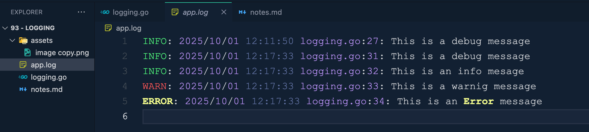

# 93 - Logging

Logging is a critical aspect of software development and operations, as it allows developers and system administrators to monitor and debug applications in go.

In Go, Logging is straightforward, and the standard libraray provides robust support through the **log** packge.

In addition to the standard libraray, there are several third party packges that offer many more advanced Logging features.

The standard **log** packges does not have built in support for logging levels like: debug info warn error.

However, we can create custom logging functions to handle different levels and we are going to see that in our example

```go
package main

import "log"

func main() {
	log.Println("This is a log Message.")
}
```

```bash
2025/10/01 11:39:42 This is a log Message.
```

**------------------------------------------------------------------------------------------------------------------------**

## using prefix with log Message

```go
package main

import "log"

func main() {
	log.Println("This is a log Message.")

	log.SetPrefix("INFO: ")
	log.Println("This is an info message.")
}
```

```bash
2025/10/01 11:41:50 This is a log Message.
INFO: 2025/10/01 11:41:50 This is an info message.
```


**------------------------------------------------------------------------------------------------------------------------**

## using log flags
these log flags are offered to us by the log package.
```go
package main

import "log"

func main() {
	log.Println("This is a log Message.")
	
	log.SetPrefix("INFO: ")
	log.Println("This is an info message.")

	//? Flags
	log.SetFlags(log.Ldate)
	log.Println("This is a log message with only date.")
}
```
```bash
2025/10/01 11:44:56 This is a log Message.
INFO: 2025/10/01 11:44:56 This is an info message.
INFO: 2025/10/01 This is a log message with only date.
```

------------------------------------------------------------------------------------------------------------------------

```go
package main

import "log"

func main() {
	log.Println("This is a log Message.")
	
	log.SetPrefix("INFO: ")
	log.Println("This is an info message.")

	//? Flags
	log.SetFlags(log.Ldate | log.Ltime)
	log.Println("This is a log message with date and time")
}
```
```bash
2025/10/01 11:46:07 This is a log Message.
INFO: 2025/10/01 11:46:07 This is an info message.
INFO: 2025/10/01 11:46:07 This is a log message with date and time
```

------------------------------------------------------------------------------------------------------------------------

```go
package main

import "log"

func main() {
	log.Println("This is a log Message.")
	
	log.SetPrefix("INFO: ")
	log.Println("This is an info message.")

	//? Flags
	log.SetFlags(log.Ldate | log.Ltime | log.Lshortfile)
	log.Println("This is a log message with date and time and file name")
}
```
```bash
2025/10/01 11:47:33 This is a log Message.
INFO: 2025/10/01 11:47:33 This is an info message.
INFO: 2025/10/01 11:47:33 logging.go:13: This is a log message with date and time and file name
```

**------------------------------------------------------------------------------------------------------------------------**

## We can define our custom logging functions to handle different levels of logging.
```go
package main

import (
	"log"
	"os"
)

var (
	infoLogger = log.New(os.Stdout, "INFO: ", log.Ldate | log.Ltime | log.Lshortfile)
	warnLogger = log.New(os.Stdout, "WARN: ", log.Ldate | log.Ltime | log.Lshortfile)
	errorLogger = log.New(os.Stdout, "ERROR: ", log.Ldate | log.Ltime | log.Lshortfile)
)

func main() {
	infoLogger.Println("This is an info message.")
	warnLogger.Println("This is a warning message.")
	errorLogger.Println("This is an error message")
}
```
```bash
INFO: 2025/10/01 11:58:47 logging.go:15: This is an info message.
WARN: 2025/10/01 11:58:47 logging.go:16: This is a warning message.
ERROR: 2025/10/01 11:58:47 logging.go:17: This is an error message
```

**------------------------------------------------------------------------------------------------------------------------**

## adding our log message into a file instead of the standard output, into the terminal
```go
package main

import (
	"log"
	"os"
)

var (
	infoLogger = log.New(os.Stdout, "INFO: ", log.Ldate | log.Ltime | log.Lshortfile)
	warnLogger = log.New(os.Stdout, "WARN: ", log.Ldate | log.Ltime | log.Lshortfile)
	errorLogger = log.New(os.Stdout, "ERROR: ", log.Ldate | log.Ltime | log.Lshortfile)
)

func main() {
	infoLogger.Println("This is an info message.")
	warnLogger.Println("This is a warning message.")
	errorLogger.Println("This is an error message")

	file, err := os.OpenFile("app.log", os.O_CREATE | os.O_WRONLY | os.O_APPEND, 0666)
	if err != nil {
		log.Fatalf("Error: %v", err)
	}

	defer file.Close()

	debugLogger := log.New(file, "INFO: ", log.Ldate | log.Ltime | log.Lshortfile)
	debugLogger.Println("This is a debug message")
}
```


------------------------------------------------------------------------------------------------------------------------

```go
package main

import (
	"log"
	"os"
)

var (
	infoLogger = log.New(os.Stdout, "INFO: ", log.Ldate | log.Ltime | log.Lshortfile)
	warnLogger = log.New(os.Stdout, "WARN: ", log.Ldate | log.Ltime | log.Lshortfile)
	errorLogger = log.New(os.Stdout, "ERROR: ", log.Ldate | log.Ltime | log.Lshortfile)
)

func main() {
	infoLogger.Println("This is an info message.")
	warnLogger.Println("This is a warning message.")
	errorLogger.Println("This is an error message")

	file, err := os.OpenFile("app.log", os.O_CREATE | os.O_WRONLY | os.O_APPEND, 0666)
	if err != nil {
		log.Fatalf("Error: %v", err)
	}

	defer file.Close()

	infoLogger1 := log.New(file, "INFO: ", log.Ldate | log.Ltime | log.Lshortfile)
	warnLogger1 := log.New(file, "WARN: ", log.Ldate | log.Ltime | log.Lshortfile)
	errorLogger1 := log.New(file, "ERROR: ", log.Ldate | log.Ltime | log.Lshortfile)
	debugLogger := log.New(file, "INFO: ", log.Ldate | log.Ltime | log.Lshortfile)

	debugLogger.Println("This is a debug message")
	infoLogger1.Println("This is an info mesage")
	warnLogger1.Println("This is a warnig message")
	errorLogger1.Println("This is an Error message")

}
```
```bash
INFO: 2025/10/01 12:17:33 logging.go:15: This is an info message.
WARN: 2025/10/01 12:17:33 logging.go:16: This is a warning message.
ERROR: 2025/10/01 12:17:33 logging.go:17: This is an error message
```


**------------------------------------------------------------------------------------------------------------------------**

## advanced logging features - using third party packages.
One of the popular packages that is used by a lot of developers purse is logrus.
Another one is zap
[Go Packaes](https://pkg.go.dev/)

**first initialize the module** ->
```bash
go mod init application-name
```

Now this .mod file is going to contain all the dependencies that are related to our current package to our application.
### using logrus package
```bash
go get github.com/sirupsen/logrus
```

```go
package main

import "github.com/sirupsen/logrus"

func main() {
	log := logrus.New()

	//? set log level
	log.SetLevel(logrus.InfoLevel)

	//? Set log format
	log.SetFormatter(&logrus.JSONFormatter{})

	//? logging examples
	log.Info("This is a info message")
	log.Warn("This is a warn message")
	log.Error("This is an error message")

	log.WithFields(logrus.Fields{
		"userName" : "John Doe",
		"method" : "GET",
	}).Info("User logged in.")
}
```
```bash
{"level":"info","msg":"This is a info message","time":"2025-10-01T13:17:36+06:00"}
{"level":"warning","msg":"This is a warn message","time":"2025-10-01T13:17:36+06:00"}
{"level":"error","msg":"This is an error message","time":"2025-10-01T13:17:36+06:00"}
{"level":"info","method":"GET","msg":"User logged in.","time":"2025-10-01T13:17:36+06:00","userName":"John Doe"}
```

**------------------------------------------------------------------------------------------------------------------------**

### using zap
```bash
go get go.uber.org/zap
```

```go
package main

import (
	"fmt"

	"go.uber.org/zap"
)

func main() {
	logger, err := zap.NewProduction()
	if err != nil {
		fmt.Println("Error in initializing Zap logger")
		return
	}
	/*
		zap logger can contain some buffer by the end of the function,
		so it is better to flush any buffer that the logger contains.
		for that zap logger instance gives us an option of logger.sync()
	*/

	defer logger.Sync()
	
	//? Now, start logging
	logger.Info("This is info message.")
}
```
```bash
{"level":"info","ts":1759303826.379439,"caller":"93 - Logging/zap_log.go:24","msg":"This is info message."}
```

------------------------------------------------------------------------------------------------------------------------

```go
package main

import (
	"fmt"

	"go.uber.org/zap"
)

func main() {
	logger, err := zap.NewProduction()
	if err != nil {
		fmt.Println("Error in initializing Zap logger")
		return
	}
	/*
		zap logger can contain some buffer by the end of the function,
		so it is better to flush any buffer that the logger contains.
		for that zap logger instance gives us an option of logger.sync()
	*/

	defer logger.Sync()
	
	//? Now, start logging
	logger.Info("This is info message.")
	logger.Info("User logged in.", zap.String("username", "John Doe"), zap.String("method", "GET"))
}
```
```bash
{"level":"info","ts":1759307438.1739688,"caller":"93 - Logging/zap_log.go:24","msg":"This is info message."}
{"level":"info","ts":1759307438.174047,"caller":"93 - Logging/zap_log.go:25","msg":"User logged in.","username":"John Doe","method":"GET"}
```

**------------------------------------------------------------------------------------------------------------------------**

- Why logging always use log levels, using appropriate log levels to filter logs based on the importance and severity is a standard practice acrcoss the globe, and this is what you should also folow.

- Use structured logging to make logs easier to parse and analyze.

- Add contextual information to logs to provide more details about the execution context, which we are going to comeback to in the context lecture.

- Implement log rotation to manage log file size and prevent disk space issues.

- log rotation is a technique used to manage the size of log files by periodically rotating them out and starting new ones. This helps prevent log files from growing indefintely and consuming all available disk space. Implementing log rotation ensures that old log data is archived, deleted, or compressed, making it easier to manage logs and maintain system performance. You can do log rotation based on the file size, or based on the number of days for specific duration, and once that duration has passed, you can choose to archive or compress the old log and start a new one.