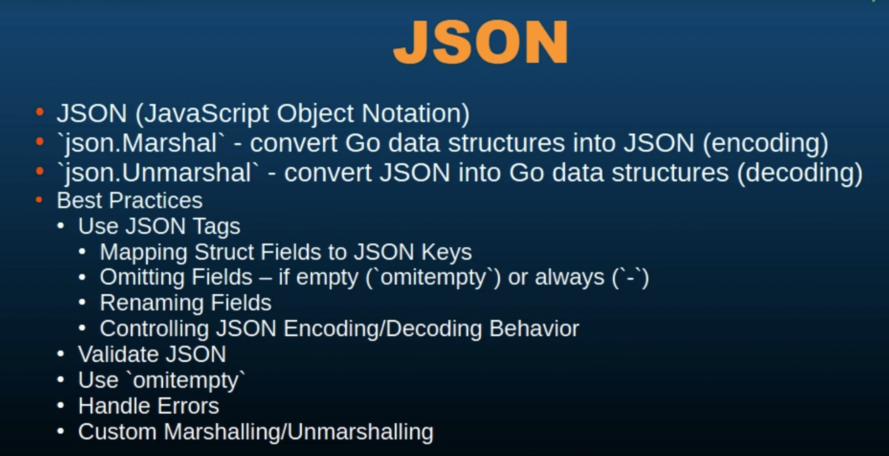

# 94 - JSON
JSON, which stands for JavaScript Object Notation, is a lightweight data interchange format that is for humans to read and write, and easy for machines to parse and generate.

It is commonly used for **transmitting data** in web applications.

In Go, JSON handling is straightforward thanks to the encoding JSON package.

The Encoding JSON package provides functions to **encode** which is called **Marshall** and **Decode**, which is called **Unmarshall** JSON data.

To convert go data structures into JSON, we use the **JSON.Marshall()** function.

**----------------------------------------------------------------------------------------------------------------------------------**

```go
package main

type person struct {
	name string `json:"name"`
	age int `json:"age"`
}

func main() {

}
```
Bacticks in struct are primarily used for **struct field tags** which provide metadata about the fields.

These tags are especially useful when you need to convert a struct to JSON or interact with databases.

Let's break down the use of Bacticks in struct tags and other contexts:
- In this example the struct person has fields name and age, and each field has a tag specifying the JSON key to use when the struct is Marshalled to JSON. So what are doing is we are mentioning the field that needs to be there when this struct is changed into a JSON. **Why we are doing this?**
```go
package main

type Person struct {
	Name string `json:"name"`
	Age int `json:"age"`
}

func main() {

}
```
If we are exporting this struct and the fields then in that case, all these will have the first character as uppercase, But in JSON the keys are all lowecase, and that's why we will have to use lowecase fields.
When this is converting to JSON, the JSON package looks for the JSON tag.

- struct tags can be used for tags that can specify column names or primary keys, etc, when using database ORM(Object Relation Management)

- Tags can also provide validation rules because when i'll be making an API, i will be using **db** instead of **json**
```go
package main

type Person struct {
	Name string `json:"name" db:"user_name"`
	Age int `json:"age" db:"age"`
}

func main() {

}
```

**----------------------------------------------------------------------------------------------------------------------------------**

```go
package main

import (
	"encoding/json"
	"fmt"
)

type Person struct {
	Name string `json:"first_name" db:"user_name"`
	Age int `json:"age" db:"age"`
}

func main() {
	person := Person{Name: "John", Age: 34}

	//? Marshalling -> Encoding
	jsonData, err := json.Marshal(person)
	if err != nil {
		fmt.Println("Error marshalling to JSON: ", err)
		return
	}

	fmt.Println(string(jsonData))
}
```
```bash
{"first_name":"John","age":34}
```

**----------------------------------------------------------------------------------------------------------------------------------**

**The struct field tags in Go control how fields are encoded and Decoded.**
**They can specify field names, but apart from just the field names we can also omit empty fields.**
```go
package main

import (
	"encoding/json"
	"fmt"
)

type Person struct {
	Name string `json:"first_name"`
	Age int `json:"age, omitempty"`
	Email string `json:"email"`
}

func main() {
	person := Person{Name: "John", Email: "somelahmed.prog@gmail.com"}

	//? Marshalling -> Encoding
	jsonData, err := json.Marshal(person)
	if err != nil {
		fmt.Println("Error marshalling to JSON: ", err)
		return
	}

	fmt.Println(string(jsonData))
}
```
```bash
{"first_name":"John","age":0,"email":"somelahmed.prog@gmail.com"}
```

----------------------------------------------------------------------------------------------------------------------------------

```go
package main

import (
	"encoding/json"
	"fmt"
)

type Person struct {
	Name string `json:"first_name"`
	Age int `json:"age,omitempty"`
	Email string `json:"email"`
}

func main() {
	person := Person{Name: "John", Email: "somelahmed.prog@gmail.com"}

	//? Marshalling -> Encoding
	jsonData, err := json.Marshal(person)
	if err != nil {
		fmt.Println("Error marshalling to JSON: ", err)
		return
	}

	fmt.Println(string(jsonData))
}
```
```bash
{"first_name":"John","email":"somelahmed.prog@gmail.com"}
```

----------------------------------------------------------------------------------------------------------------------------------

```go
package main

import (
	"encoding/json"
	"fmt"
)

type Person struct {
	Name string `json:"first_name"`
	Age int `json:"age,omitempty"`
	Email string `json:"email"`
}

func main() {
	person := Person{Name: "John"}

	//? Marshalling -> Encoding
	jsonData, err := json.Marshal(person)
	if err != nil {
		fmt.Println("Error marshalling to JSON: ", err)
		return
	}

	fmt.Println(string(jsonData))
}
```
```bash
{"first_name":"John","email":""}
```

**----------------------------------------------------------------------------------------------------------------------------------**

## JSON Objects can be nested and go's concoding JSON package can handle these nested structures.
```go
package main

import (
	"encoding/json"
	"fmt"
)

type Address struct {
	City string `json:"city"`
	State string `json:"state"`
}

type Person struct {
	Name string `json:"first_name"`
	Age int `json:"age,omitempty"`
	Email string `json:"email,omitempty"`
	Address Address `json:"address"`
}

func main() {
	person := Person{Name: "John", Age: 32, Email: "somelahmed.prog@gmail.com", Address: Address{
		City: "NY", State: "NY",
	}}

	//? Marshalling - Encoding
	jsonData, err := json.Marshal(person)
	if err != nil {
		fmt.Println("Error Marshalling to JSON: ", err)
		return
	}
	fmt.Println(string(jsonData))
}
```
```bash
{"first_name":"John","age":32,"email":"somelahmed.prog@gmail.com","address":{"city":"NY","state":"NY"}}
```

**----------------------------------------------------------------------------------------------------------------------------------**

## Decoding nested JSON Object usign json.Unmarshall()
```go
package main

import (
	"encoding/json"
	"fmt"
)

type Address struct {
	City string `json:"city"`
	State string `json:"state"`
}

type Employee struct {
	FullName string `json:"full_name"`
	EmpID string 	`json:"emp_id"`
	Age int `json:"age"`
	Address Address `json:"address"`
}

func main() {

	jsonData := `{"full_name": "John Doe", "emp_id": "009", "age": 33, "address": {"city": "NY", "State": "CA"}}`

	var employeeFromJson Employee
	err := json.Unmarshal([]byte(jsonData), &employeeFromJson)
	if err != nil {
		fmt.Println("Error unmarshalling from JSON: ", err)
		return
	}
	fmt.Println(employeeFromJson)
	fmt.Println(employeeFromJson.FullName)

}
```
```bash
{John Doe 009 33 {NY CA}}
John Doe
```

**----------------------------------------------------------------------------------------------------------------------------------**

## Handling JSON in Array and Slice
```go
package main

import (
	"encoding/json"
	"fmt"
	"log"
)

type Address struct {
	City string `json:"city"`
	State string `json:"state"`
}

type Employee struct {
	FullName string `json:"full_name"`
	EmpID string 	`json:"emp_id"`
	Age int `json:"age"`
	Address Address `json:"address"`
}

func main() {

	listOfCityState := []Address{
		{City: "New York", State: "NY"},
		{City: "San Jose", State: "CA"},
		{City: "Los Vegas", State: "LA"},
		{City: "Modesto", State: "CA"},
	}
	fmt.Println(listOfCityState)
	jsonList, err := json.Marshal(listOfCityState)
	if err != nil {
		log.Fatalln("Error Marshalling to JSON: ", err)
		return
	}

	fmt.Println("Json List: ", string(jsonList))

}
```
```bash
[{New York NY} {San Jose CA} {Los Vegas LA} {Modesto CA}]
Json List:  [{"city":"New York","state":"NY"},{"city":"San Jose","state":"CA"},{"city":"Los Vegas","state":"LA"},{"city":"Modesto","state":"CA"}]
```

**----------------------------------------------------------------------------------------------------------------------------------**

## Handling Unknown JSON structures
```go
package main

import (
	"encoding/json"
	"fmt"
)

type Address struct {
	City string `json:"city"`
	State string `json:"state"`
}

type Employee struct {
	FullName string `json:"full_name"`
	EmpID string 	`json:"emp_id"`
	Age int `json:"age"`
	Address Address `json:"address"`
}

func main() {

	jsonData := `{"name": "John", "age": 30, "address": {"city": "New York", "state": "NY"}}`

	//? as this is an unknown JSON structure, we can not make a struct

	var data map[string]interface{}

	err := json.Unmarshal([]byte(jsonData), &data)
	if err != nil {
		fmt.Println("Error unmarshalling JSON: ", err)
		return
	}
	fmt.Println("Decoded/unMarshalled JSON: ", data)
	fmt.Println("Decoded/unMarshalled JSON address: ", data["address"])
	fmt.Println("Decoded/unMarshalled JSON name: ", data["name"])

}
```
```bash
Decoded/unMarshalled JSON:  map[address:map[city:New York state:NY] age:30 name:John]
Decoded/unMarshalled JSON address:  map[city:New York state:NY]
Decoded/unMarshalled JSON name:  John
```

**----------------------------------------------------------------------------------------------------------------------------------**

First thing is to use **struct tags** to control JSON encoding and decoding.

Struct tags play a crucial role in controlling how data is encoded and decoded, especially when working with JSON, they allow you to specify details about how struct fields should be represented in JSON, providing more flexibility and control.

Struct tags can be used to map struct field names to specific JSON keys, which might not match the go field names, the field names in that struct, and this is useful when working with API'S or data source, where the JSON Keys have different naming conventions.

Struct tags can indicate that certain fields should be omitted from the JSON output, either when they have zero values. or always.

We can also rename struct fields in the JSON output using struct tags.

This is useful for ensuring the JSON output meets specific schema requirements.
