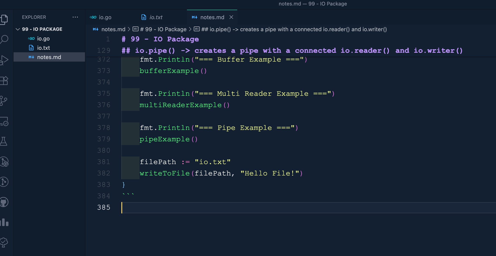

# 99 - IO Package
IO Package is a standard library Package in Go for **input** and **output** operations.
It provides interfaces and functions for reading and writing data.

**Why IO Package is important?**
It facilitates interaction with various data source like files, networks or in-memory buffers, and many more.

It also provides a consistent interface for handling IO operations and we are going to dive deeper into that.

**Some core interfaces of IO Package are:**
- io.reader() -> It is an interface for reading data from a source, and the method is read. It is implemented by OS Package with os.file(), and io.reader() is also implemented in the strings package using strings.reader and it is also implemented by byte.buffer()

- io.writer() -> It is an interface for writing data to a destination. The method is write and it is implemented again by OS package, os.file() method. Instead of strings.writer(), there are strings.builder(), but it does use the io.writer() as the interface.

- Apart from, io.reader() and io.writer(), we also have io.copy(), which copies data from an io.reader() to an io.writer(). It is useful for transferring data between streams.

## Reading Data
```go
var buf bytes.Buffer
buf := new(bytes.Buffer)
```
The new() allowcates memory for a new byteBuffer instance.
The difference is that this statement new byteBuffer allocates memory for a new byteBuffer instance.
Although both lines of code will create a new bytes.Buffer, they do son in slightly different ways. 

**Why this happen?**
```go
func multiReaderExample() {
	r1 := strings.NewReader("Hello")
	r2 := strings.NewReader("World!")
	mr := io.MultiReader(r1, r2)
	buf := new(bytes.Buffer) 
}
```
In this function, this time we need a pointer. We are creating a multi-reader. We need to read from two resources. And that's why we need to create a pointer that is going to store the read values, the values that it reads into a memory address. And then we are going to access that memory address and extract the value that is stored in buffer. So this time we are creating a pointer instead of a value. So, buf is a pointer to bytes.Buffer. Buf is not of type bytes.Buffer but buff is of type pointer to bytes.Buffer. And this is a common way to create a new instance of a type and get a pointer to it.

```go
var buf bytes.Buffer
```
This statement is a declaration with var and it creates a variable buf of type bytes.Buffer. It allocates a bytes.Buffer instance directly and not a pointer, and initializes it to its zero value. This is a more traditional way to declare a variable and directly create an instance of the type.

The key difference between these two is that new bytes.Buffer allocates memory in the heap, which can be useful if you need to pass around the buffer or manage its lifetime explicitly.
However. var buf bytes.Buffer creates memory on the stack, and unless it's part of a struct or otherwise managed by the go runtime, the memory allocation will be on the stack, but if it's part of a struct or may be managed by a go runtime, then it could be on the heap. 

What the pointer bytes.Buffer does is that it allows us to modify the buffer in place and share the buffer between functions without copying it.

```go
package main

import (
	"bytes"
	"fmt"
	"io"
	"log"
	"strings"
)

func readFromReader(r io.Reader) {
	buf := make([]byte, 1024)
	n, err := r.Read(buf)
	if err != nil {
		log.Fatalln("Error reading from reader: ", err)
	}
	fmt.Println(string(buf[:n])) //? 0 to n-1
}

func writeToWriter(w io.Writer, data string) {
	_, err := w.Write([]byte(data))
	if err != nil {
		log.Fatalln("Error writing in writer: ", err)
	}

}

func closeResource(c io.Closer) {
	err := c.Close()
	if err != nil {
		log.Fatalln("Error closing resource: ", err)
	}
}

func bufferExample() {
	var buf bytes.Buffer
	buf.WriteString("Hello Buffer!")
	fmt.Println(buf.String())
}

func multiReaderExample() {
	r1 := strings.NewReader("Hello ")
	r2 := strings.NewReader("World!")
	mr := io.MultiReader(r1, r2)
	buf := new(bytes.Buffer) 
	_, err := buf.ReadFrom(mr)
	if err != nil {
		log.Fatalln("Error reading from reader: ", err)
	}
	fmt.Println(buf.String())
}

func main() {
	fmt.Println("=== Read from the Reader ===")
	readFromReader(strings.NewReader("Hello Reader!"))

	fmt.Println("=== Write to writer ===")
	var writer bytes.Buffer
	writeToWriter(&writer, "Hello Writer")
	fmt.Println(writer.String())

	fmt.Println("=== Buffer Example ===")
	bufferExample()

	fmt.Println("=== Multi Reader Example ===")
	multiReaderExample()
}
```
```bash
=== Read from the Reader ===
Hello Reader!
=== Write to writer ===
Hello Writer
=== Buffer Example ===
Hello Buffer!
=== Multi Reader Example ===
Hello World!
```

**----------------------------------------------------------------------------------------------------------------------------**

## io.pipe() -> creates a pipe with a connected io.reader() and io.writer()
It returns two values, one value will be reader and another value will be writer.
```go
package main

import (
	"bytes"
	"fmt"
	"io"
	"log"
	"strings"
)

func readFromReader(r io.Reader) {
	buf := make([]byte, 1024)
	n, err := r.Read(buf)
	if err != nil {
		log.Fatalln("Error reading from reader: ", err)
	}
	fmt.Println(string(buf[:n])) //? 0 to n-1
}

func writeToWriter(w io.Writer, data string) {
	_, err := w.Write([]byte(data))
	if err != nil {
		log.Fatalln("Error writing in writer: ", err)
	}

}

func closeResource(c io.Closer) {
	err := c.Close()
	if err != nil {
		log.Fatalln("Error closing resource: ", err)
	}
}

func bufferExample() {
	var buf bytes.Buffer
	buf.WriteString("Hello Buffer!")
	fmt.Println(buf.String())
}

func multiReaderExample() {
	r1 := strings.NewReader("Hello ")
	r2 := strings.NewReader("World!")
	mr := io.MultiReader(r1, r2)
	buf := new(bytes.Buffer) 
	_, err := buf.ReadFrom(mr)
	if err != nil {
		log.Fatalln("Error reading from reader: ", err)
	}
	fmt.Println(buf.String())
}

func pipeExample() {
	pr, pw := io.Pipe()
	//? If we add the go keyword before the function, it becomes a go routine
	//? Go routines are functions that are immediately executed and they are anonymous
	/* this go keyword extracts this function out of the main thread.
	So it this function is going to take let's say 30 minutes, the next statement will not wait for 
	30 minutes to get executed.
	this functio will be extracted away from the main thread and the execution will fall on the next line
	The subsequent line will be executed. And this function, once it is completed, then it will come back to
	the main thread.
	Like async, await in javascript
	*/
	go func() {
		pw.Write([]byte("Hello Pipe"))
		pw.Close()
	}()

	buf := new(bytes.Buffer)
	buf.ReadFrom(pr)
	fmt.Println(buf.String())
}

func main() {
	fmt.Println("=== Read from the Reader ===")
	readFromReader(strings.NewReader("Hello Reader!"))

	fmt.Println("=== Write to writer ===")
	var writer bytes.Buffer
	writeToWriter(&writer, "Hello Writer")
	fmt.Println(writer.String())

	fmt.Println("=== Buffer Example ===")
	bufferExample()

	fmt.Println("=== Multi Reader Example ===")
	multiReaderExample()

	fmt.Println("=== Pipe Example ===")
	pipeExample()
}
```
```bash
=== Read from the Reader ===
Hello Reader!
=== Write to writer ===
Hello Writer
=== Buffer Example ===
Hello Buffer!
=== Multi Reader Example ===
Hello World!
=== Pipe Example ===
Hello Pipe
```
A pipe is a way to connect two pieces of code so that data can flow from one to another.
It is like tunnel through which information travels.
In Go, io.pipe() function creates a pipe with two ends.
Reader end is the end from which data wll be read, and writer which is pw in this example end to which data will be written.

**Now, understand how the example works:**
The first line creates a pipe, PR is the reader end and pw is is the writer end.
In the next line, we create a go routine, a go routine for writing data. This starts a new go routine, which is like starting a new thread of execution.
Inside this go routine, we first write the string "hello pipe" to the pipe writer. We are using pipe writer to write to the pipe.
And now on the next line **pw.close()** closes the writer end of the pipe.

In the next line, we are creating a new buffer which is a temporary storage area where data can be kept before it is used, and in the next line we read from the pipe. So reading will be done from the reading end of the pipe.

Reading will be done on the data that has been written by the writer. They are going to share the data. Writer is going to write data, store data and then reader is going to read that data and output that.

So,
```go
buf.ReadFrom(pr)
```
it reads all the data from the reader end of the pipe into the buffer.
Finally, we use the buffer to print the output, print the data that was read from the pipe.
So, this function demonstrates a simple way to pass data between different parts of our program.
And this can be used practically in many, many situations where you're passing data from different
points, different end points, different functions between your big application.
And the best part is that we are taking help of a go routine to handle concurrent operations. so that we do not block the main thread of execution of our program.

**----------------------------------------------------------------------------------------------------------------------------**

```go
package main

import (
	"bytes"
	"fmt"
	"io"
	"log"
	"os"
	"strings"
)

func readFromReader(r io.Reader) {
	buf := make([]byte, 1024)
	n, err := r.Read(buf)
	if err != nil {
		log.Fatalln("Error reading from reader: ", err)
	}
	fmt.Println(string(buf[:n])) //? 0 to n-1
}

func writeToWriter(w io.Writer, data string) {
	_, err := w.Write([]byte(data))
	if err != nil {
		log.Fatalln("Error writing in writer: ", err)
	}

}

func closeResource(c io.Closer) {
	err := c.Close()
	if err != nil {
		log.Fatalln("Error closing resource: ", err)
	}
}

func bufferExample() {
	var buf bytes.Buffer
	buf.WriteString("Hello Buffer!")
	fmt.Println(buf.String())
}

func multiReaderExample() {
	r1 := strings.NewReader("Hello ")
	r2 := strings.NewReader("World!")
	mr := io.MultiReader(r1, r2)
	buf := new(bytes.Buffer) 
	_, err := buf.ReadFrom(mr)
	if err != nil {
		log.Fatalln("Error reading from reader: ", err)
	}
	fmt.Println(buf.String())
}

func writeToFile(filePath string, data string) {
	file, err := os.OpenFile(filePath, os.O_APPEND | os.O_CREATE | os.O_WRONLY, 0644)
	if err != nil {
		log.Fatalln("Error opening/creating file: ", err)
	}
	defer closeResource(file)
	
	_, err = file.Write([]byte(data))
	if err != nil {
		log.Fatalln("Error writing to file: ", err)
	}

	//? alternative way to write the above lines
	// Type(value)
	// writer := io.Writer(file)
	// _, err = writer.Write([]byte(data))
	// if err != nil {
	// 	log.Fatalln("Error to writing to file: ", err)
	// }

}

func pipeExample() {
	pr, pw := io.Pipe()
	//? If we add the go keyword before the function, it becomes a go routine
	//? Go routines are functions that are immediately executed and they are anonymous
	/* this go keyword extracts this function out of the main thread.
	So it this function is going to take let's say 30 minutes, the next statement will not wait for 
	30 minutes to get executed.
	this functio will be extracted away from the main thread and the execution will fall on the next line
	The subsequent line will be executed. And this function, once it is completed, then it will come back to
	the main thread.
	Like async, await in javascript
	*/
	go func() {
		pw.Write([]byte("Hello Pipe"))
		pw.Close()
	}()

	buf := new(bytes.Buffer)
	buf.ReadFrom(pr)
	fmt.Println(buf.String())
}

func main() {
	fmt.Println("=== Read from the Reader ===")
	readFromReader(strings.NewReader("Hello Reader!"))

	fmt.Println("=== Write to writer ===")
	var writer bytes.Buffer
	writeToWriter(&writer, "Hello Writer")
	fmt.Println(writer.String())

	fmt.Println("=== Buffer Example ===")
	bufferExample()

	fmt.Println("=== Multi Reader Example ===")
	multiReaderExample()

	fmt.Println("=== Pipe Example ===")
	pipeExample()

	filePath := "io.txt"
	writeToFile(filePath, "Hello File!")
}
```


----------------------------------------------------------------------------------------------------------------------------

```go
package main

import (
	"bytes"
	"fmt"
	"io"
	"log"
	"os"
	"strings"
)

type MyResource struct {
	name string
}

func (m MyResource) Close() error {
	fmt.Println("Closing Resourse: ", m.name)
	return nil
}

func readFromReader(r io.Reader) {
	buf := make([]byte, 1024)
	n, err := r.Read(buf)
	if err != nil {
		log.Fatalln("Error reading from reader: ", err)
	}
	fmt.Println(string(buf[:n])) //? 0 to n-1
}

func writeToWriter(w io.Writer, data string) {
	_, err := w.Write([]byte(data))
	if err != nil {
		log.Fatalln("Error writing in writer: ", err)
	}

}

func closeResource(c io.Closer) {
	err := c.Close()
	if err != nil {
		log.Fatalln("Error closing resource: ", err)
	}
}

func bufferExample() {
	var buf bytes.Buffer
	buf.WriteString("Hello Buffer!")
	fmt.Println(buf.String())
}

func multiReaderExample() {
	r1 := strings.NewReader("Hello ")
	r2 := strings.NewReader("World!")
	mr := io.MultiReader(r1, r2)
	buf := new(bytes.Buffer) 
	_, err := buf.ReadFrom(mr)
	if err != nil {
		log.Fatalln("Error reading from reader: ", err)
	}
	fmt.Println(buf.String())
}

func writeToFile(filePath string, data string) {
	file, err := os.OpenFile(filePath, os.O_APPEND | os.O_CREATE | os.O_WRONLY, 0644)
	if err != nil {
		log.Fatalln("Error opening/creating file: ", err)
	}
	defer closeResource(file)
	
	_, err = file.Write([]byte(data))
	if err != nil {
		log.Fatalln("Error writing to file: ", err)
	}

	//? alternative way to write the above lines
	// Type(value)
	// writer := io.Writer(file)
	// _, err = writer.Write([]byte(data))
	// if err != nil {
	// 	log.Fatalln("Error to writing to file: ", err)
	// }

}

func pipeExample() {
	pr, pw := io.Pipe()
	//? If we add the go keyword before the function, it becomes a go routine
	//? Go routines are functions that are immediately executed and they are anonymous
	/* this go keyword extracts this function out of the main thread.
	So it this function is going to take let's say 30 minutes, the next statement will not wait for 
	30 minutes to get executed.
	this functio will be extracted away from the main thread and the execution will fall on the next line
	The subsequent line will be executed. And this function, once it is completed, then it will come back to
	the main thread.
	Like async, await in javascript
	*/
	go func() {
		pw.Write([]byte("Hello Pipe"))
		pw.Close()
	}()

	buf := new(bytes.Buffer)
	buf.ReadFrom(pr)
	fmt.Println(buf.String())
}

func main() {
	fmt.Println("=== Read from the Reader ===")
	readFromReader(strings.NewReader("Hello Reader!"))

	fmt.Println("=== Write to writer ===")
	var writer bytes.Buffer
	writeToWriter(&writer, "Hello Writer")
	fmt.Println(writer.String())

	fmt.Println("=== Buffer Example ===")
	bufferExample()

	fmt.Println("=== Multi Reader Example ===")
	multiReaderExample()

	fmt.Println("=== Pipe Example ===")
	pipeExample()

	filePath := "io.txt"
	writeToFile(filePath, "Hello File!")

	resource := &MyResource{name: "Test Resource"}
	closeResource(resource)
}
```
```bash
=== Read from the Reader ===
Hello Reader!
=== Write to writer ===
Hello Writer
=== Buffer Example ===
Hello Buffer!
=== Multi Reader Example ===
Hello World!
=== Pipe Example ===
Hello Pipe
Closing Resourse:  Test Resource
```

**----------------------------------------------------------------------------------------------------------------------------**

## io package VS bufio package

