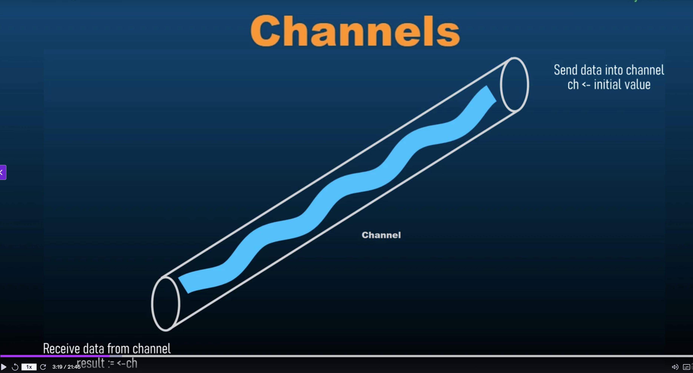

# 105 - Unbuffered Channels and Runtime Mechanism

By default when we create a channel with this syntax:

```go
greeting := make(chan string)
```

this is called **Unbuffered Channel**

**Buffered Channel means channel with storage.** A buffer is a storage. So a channel with an associated storage is called buffered channel.

Channel buffering does is that it allows Channels to hold a limited number of values before blocking the sender.

Buffered Channels are useful for managing data flow and controlling concurrency.

**Why should we use buffer Channels over Unbuffered Channels?**
The most important and significant difference between buffered channels and Unbuffered channels is that **buffered channel allow asynchronous communication**, which means that buffered channels allow senders to continue working without blocking until the buffer is full. Buffer channel will only block when the Buffer is full.

Buffer channels also help us in load balancing, handling bursts of data without immdediate synchronization and hence buffer channels also allow for a better flow control, meaning that we can manage the rate of data between producers and consumers.

---

## Unbuffered Channel

```go
package main

func main() {
	greeting := make(chan string)
	greetingString := "Hello"

	go func(){
		greeting <- greetingString
	}()
}
```

Unbuffered Channel need an immdediate receiver and that's why we can not use a send inside the main function. We can not send data into an unbuffered channel inside the main function, because as soon as we do that it will immdediately look for a receiver and it will not find the receiver. The receiver will be in the next line. However, the unbuffered channels require an immdediate receiver as soon as they are receiving a value inside them. They need someone to receive those values into. They need a variable to which they can pass their value to.

So, when we are talking about channels, consider channel like a flowing stream, a flow of water.


So, what Unbuffered channel always needs, it is designed in such a way, in the go language that it needs an immdediate receiver.

As soon as, we pass a value inside the greeting channel:

```go
greeting <- greetingString
```

It will immdediately look for a receiver and receiver is this:

```go
receiver := <- greeting
```

We are passing the value from greeting towards this receiver. So what it will do is as soon as it receives a value, it will try to find the channel that is going to emit this value to another variable. And now what happens here in this main function is that this go routine:

```go
go func(){
		greeting <- greetingString
}()
```

gets out of the main thread. It goes out and the execution falls to this point:

```go
receiver := <- greeting
```

and the receiver is now ready. And the go routine it is out of the main thread and as soon as this line executes:

```go
greeting <- greetingString
```

it is able to find a receiver at the same time because the main thread works faster than the go routine, because go routine takes time to get out of the main thread and then it goes on to the next line. However, our go runtime, as soon as this go routine is extracted:

```go
go func(){
		greeting <- greetingString
}()
```

it moves on the next line, and once it moves on to the next line:

```go
receiver := <- greeting
```

during that duration. After that, the go routine moves on to the next line:
and then once it receives a value inside the channel:

```go
greeting <- greetingString
```

it is able to find a receiver:

```go
receiver := <- greeting
```

in the main thread as well. But if there is no receiver, then there will be an error.

```go
package main

func main() {
	ch := make(chan int)
	ch <- 1


}
```

```bash
fatal error: all goroutines are asleep - deadlock!

goroutine 1 [chan send]:
main.main()
        /Users/progsomel/Library/Mobile Documents/com~apple~CloudDocs/ProgSomel/Study/Programming/golang---notes/003 - Go Programming - Advanced/105 - Unbuffered Channels and Runtime Mechanism/unbuffered_channel.go:5 +0x28
exit status 2
```

There are error. The error is that as soon as a channel receives a value, it needs to pass the value to a receiving end to a receiver. It can not hold those values. Unbuffered channel can not hold values. They have to have a receiver, an immdediate receiver to receive the values from the channels. As soon as a channel receives a value, they need to send the value to another receiver.
That's how an unbuffered_channel operates.

```go
package main

import "fmt"

func main() {
	ch := make(chan int)
	ch <- 1

	receiver := <- ch
	fmt.Println(receiver)
}
```

```bash
fatal error: all goroutines are asleep - deadlock!

goroutine 1 [chan send]:
main.main()
        /Users/progsomel/Library/Mobile Documents/com~apple~CloudDocs/ProgSomel/Study/Programming/golang---notes/003 - Go Programming - Advanced/105 - Unbuffered Channels and Runtime Mechanism/unbuffered_channel.go:7 +0x36
exit status 2
```

There is an error also. Now what happens is that. Why do we need to use go routines when it comes to unbuffered_channels? because in buffered channels you will see that we do not need go routines, it is only for unbuffered_channels that we need. **Why is that?**
As soon as the execution comes to this poiint:

```go
ch <- 1
```

it sees that there is a channel and channel is receiving a value. It immediately look for a receiver. The receiver is on the next line:

```go
receiver := <- ch
```

but it can not wait for that long. It needs an immediate receiver. And that's why we say that channels are way to communicate between goroutines. Channels communicate data, pass data between goroutines. So this is why we need different goroutines. Beacause another goroutine will send value inside a channel and the main goroutine or the main thread or maybe a different thread will have a receiver ready at the same time to receive those values, we need the sender and receiver ready at the same time. So this same channel:

```go
	ch := make(chan int)
```

will have two purposes, one purpose is to receive value into it and another purpose is to send value outside from it.

```go
package main

import "fmt"

func main() {
	ch := make(chan int)
	go func() {
		ch <- 1
	}()

	receiver := <- ch
	fmt.Println(receiver)
}
```

```bash
1
```

**How the goruntime is working with channels and goroutines?**
We declare and initialize a channel:

```go
ch := make(chan int)
```

Next statement, we start goroutine:

```go
go func() {
	ch <- 1
}()
```

As soon as go runtime looks at this word go and then func, go runtime extracts the function out of the main thread, moves to next line, and it sees that receiver:

```go
receiver := <- ch
```

it is ready to receive from a channel. At the same time another thread goes to this line:

```go
ch <- 1
```

Another thread executes this function:

```go
go func() {
	ch <- 1
}()
```

it moves to this line:

```go
ch <- 1
```

and this line says that channel is receiving a value of one. So this line we are receiving value inside the channel and as soon as this executes it looks for a receiver and go routine. This goroutine:

```go
go func() {
	ch <- 1
}()
```

is associated with this main go routine the main thread of our application. Then it checks, the go runtime checks that there is a receiver and it transfers the value to this receiver:

```go
receiver := <- ch
```

in the next line, we print the value from this receiver:

```go
fmt.Println(receiver)
```

**Does the value code is also okay?**

```go
package main

import "fmt"

func main() {
	ch := make(chan int)
	ch <- 1

	go func() {
		receiver := <- ch
		fmt.Println(receiver)
	}()
}
```

in the above example, channel that receives value is in the main go routine and the receiver is also declared and this is in another goroutine.

```bash
fatal error: all goroutines are asleep - deadlock!

goroutine 1 [chan send]:
main.main()
        /Users/progsomel/Library/Mobile Documents/com~apple~CloudDocs/ProgSomel/Study/Programming/golang---notes/003 - Go Programming - Advanced/105 - Unbuffered Channels and Runtime Mechanism/unbuffered_channel.go:7 +0x2d
exit status 2
```

Error. Beacause as soon as we send a value inside a channel it needs an immediate receiver. And this is not an immediate receiver:

```go
go func() {
	receiver := <- ch
	fmt.Println(receiver)
}()
```

So this will not work. So we always send values into an unbuffered channel inside a goroutine, and then we receive those values inside the main go routine, the main thread or any other function that we have.

```go
package main

import "fmt"

func main() {
	ch := make(chan int)
	go func() {
		ch <- 1;
	}()

	receiver := <- ch
	fmt.Println(receiver)
}
```

This is how it is going to work with Unbuffered Channels.

---

```go
package main

import (
	"fmt"
	"time"
)

func main() {
	ch := make(chan int)
	go func() {
		// ch <- 1;
		time.Sleep(2 * time.Second)
	}()

	receiver := <- ch
	fmt.Println(receiver)
}
```

```bash
goroutine 1 [chan receive]:
main.main()
        /Users/progsomel/Library/Mobile Documents/com~apple~CloudDocs/ProgSomel/Study/Programming/golang---notes/003 - Go Programming - Advanced/105 - Unbuffered Channels and Runtime Mechanism/unbuffered_channel.go:15 +0x4e
exit status 2
```

It waits for two seconds and then gives an error. **How did that happen?**
What receiver channel does is that it does not read into the goroutine. All it knows is that there is a goroutine. And there is a possibility that from that goroutine I will receive some value and then i will pass that value into receiver. So what we learned here is that the receiver will wait for all the goroutines to finish, and then it will throw an error.

```go
package main

import (
	"fmt"
	"time"
)

func main() {
	ch := make(chan int)

	go func() {
		// ch <- 1;
		time.Sleep(2 * time.Second)
		fmt.Println("2 second Go routine finished")
	}()

	go func() {
		// ch <- 1;
		time.Sleep(3 * time.Second)
		fmt.Println("2 second Go routine finished")
	}()

	receiver := <- ch
	fmt.Println(receiver)
	fmt.Println("End of the program")
}
```

```bash
2 second Go routine finished
2 second Go routine finished
fatal error: all goroutines are asleep - deadlock!

goroutine 1 [chan receive]:
main.main()
        /Users/progsomel/Library/Mobile Documents/com~apple~CloudDocs/ProgSomel/Study/Programming/golang---notes/003 - Go Programming - Advanced/105 - Unbuffered Channels and Runtime Mechanism/unbuffered_channel.go:23 +0x5d
exit status 2
```

We are getting blocked here:

```go
receiver := <- ch
```

Receiver channel blocks the program, it blocks the execution flow until it

```go
ch
```

receives a value. Let send it a value:
```go
package main

import (
	"fmt"
	"time"
)

func main() {
	ch := make(chan int)

	go func() {
		ch <- 1;
		time.Sleep(2 * time.Second)
		fmt.Println("2 second Go routine finished")
	}()

	go func() {
		// ch <- 1;
		time.Sleep(3 * time.Second)
		fmt.Println("2 second Go routine finished")
	}()

	receiver := <- ch
	fmt.Println(receiver)
	fmt.Println("End of the program")
}
```
```bash
1
End of the program
```
As soon as it received a value we did get a print statement with end of program. And we are sending the value to channel:
```go
	ch <- 1;
```
before putting our go function, our goroutine to sleep. Our goroutine never got a chance to come back to the main thread, because as soon as this statement:
```go
	ch <- 1;
```
got executed, we moved on to the next statement:
```go
receiver := <- ch
```
and we printed the receiver:
```go
fmt.Println(receiver)
```
and we moved on to the next statement and that printed end of program:
```go
fmt.Println("End of the program")
```
And we did not have a Mechanism in place to wait for these go routines to come back to the main thread.

**Unbuffered channel block on receive, if there is no corresponding send operation ready and as soon as there is a send operation ready, then it doesn't block. Then it receives the value from that send operation and uses that value as per our instructions.**

Now another property of Unbuffered Channels is that Unbuffered channels block on send if there is no corresponding receive operation, and that we have exercised before:
```go
package main

import (
	"fmt"
)

func main() {
	ch := make(chan int)
	ch <- 1;

	// go func() {
	// 	time.Sleep(2 * time.Second)
	// 	fmt.Println("2 second Go routine finished")
	// }()

	// go func() {
	// 	// ch <- 1;
	// 	time.Sleep(3 * time.Second)
	// 	fmt.Println("2 second Go routine finished")
	// }()

	// receiver := <- ch
	// fmt.Println(receiver)
	fmt.Println("End of the program")
}
```
```bash
fatal error: all goroutines are asleep - deadlock!

goroutine 1 [chan send]:
main.main()
        /Users/progsomel/Library/Mobile Documents/com~apple~CloudDocs/ProgSomel/Study/Programming/golang---notes/003 - Go Programming - Advanced/105 - Unbuffered Channels and Runtime Mechanism/unbuffered_channel.go:9 +0x28
exit status 2
```
**it will block the execution.**

---

```go
package main

import (
	"fmt"
)

func main() {
	ch := make(chan int)
	go func() {
		// time.Sleep(2 * time.Second)
		// fmt.Println("2 second Go routine finished")
		fmt.Println(<-ch)
	}()
	ch <- 1;

	// go func() {
	// 	time.Sleep(2 * time.Second)
	// 	fmt.Println("2 second Go routine finished")
	// }()

	// go func() {
	// 	// ch <- 1;
	// 	time.Sleep(3 * time.Second)
	// 	fmt.Println("2 second Go routine finished")
	// }()

	// receiver := <- ch
	// fmt.Println(receiver)
	fmt.Println("End of the program")
}
```
```bash
1
End of the program
```

---

```go
package main

import (
	"fmt"
	"time"
)

func main() {
	ch := make(chan int)
	go func() {
		time.Sleep(3 * time.Second)
		fmt.Println(<-ch)

		fmt.Println("2 second Go routine finished")
	}()
	ch <- 1;

	// go func() {
	// 	time.Sleep(2 * time.Second)
	// 	fmt.Println("2 second Go routine finished")
	// }()

	// go func() {
	// 	// ch <- 1;
	// 	time.Sleep(3 * time.Second)
	// 	fmt.Println("2 second Go routine finished")
	// }()

	// receiver := <- ch
	// fmt.Println(receiver)
	fmt.Println("End of the program")
}
```
```bash
End of the program
1
2 second Go routine finished
```